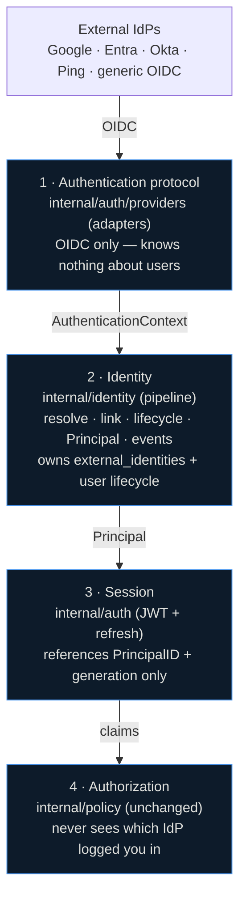
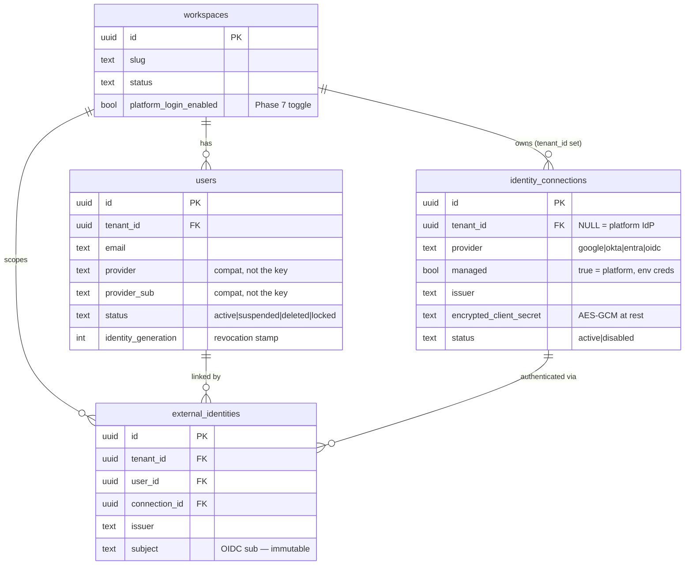
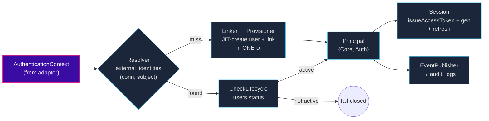
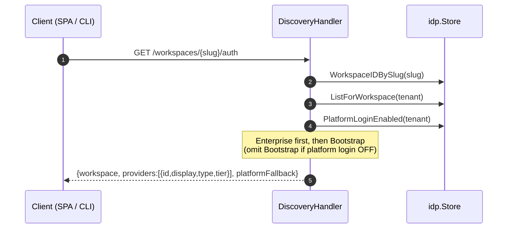
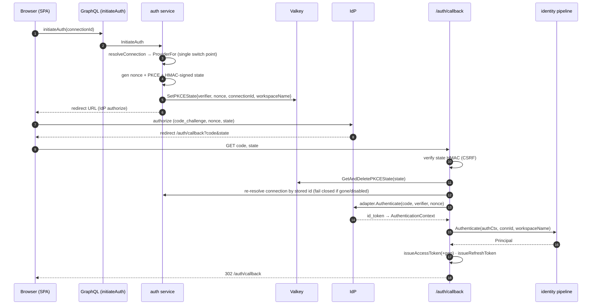
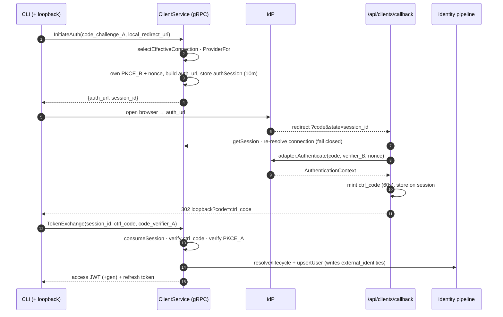
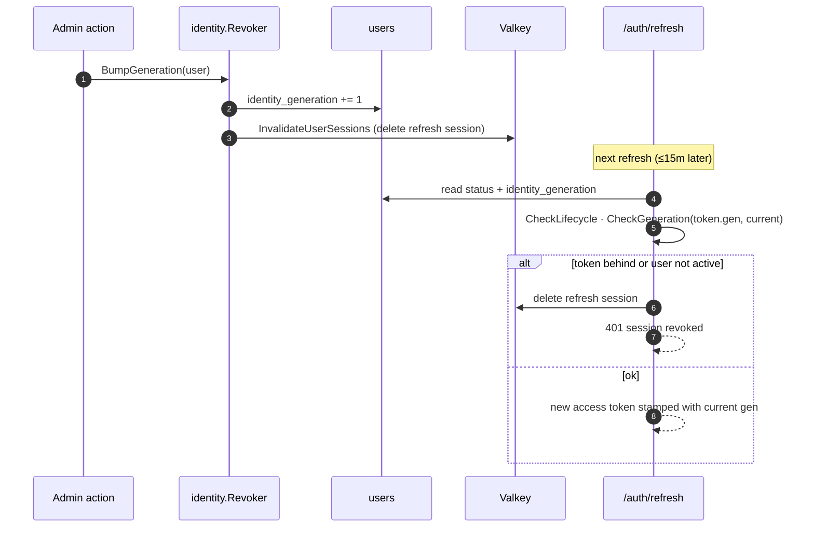

# Identity Architecture — v1.0

> **Status:** Frozen baseline (PENDING-04 complete, merged to `fixed-pendings` @ `6078ea4`)
> **Date:** 2026-08-04
> **Scope:** Human authentication & identity for the Zecurity control plane
> **Authoritative decisions:** [[ADR-023-Identity-Philosophy]], [[ADR-024-Identity-Linking-and-Provider-Migration]]
> **Supersedes:** the hardwired-Google `Bootstrap()` login path
> **Change control:** Frozen. Treat like an ADR — changes to this subsystem update this document in the same PR, under review.

---

## At a glance

One login, end to end. Every hop is a plane boundary; the trust boundary is the `AuthenticationContext`.

```mermaid
flowchart LR
    U["User"] --> D["Discovery<br/>which IdPs?"]
    D --> IdP["Identity Provider<br/>OIDC"]
    IdP --> AC["AuthenticationContext<br/>⟵ trust boundary"]
    AC --> PIPE["Identity Pipeline<br/>resolve · lifecycle · link"]
    PIPE --> PR["Principal<br/>canonical identity"]
    PR --> SES["Session<br/>JWT + refresh"]
    SES --> POL["Policy<br/>authorization"]
    POL --> RES["Resource"]

    classDef boundary fill:#3a0ca3,stroke:#f72585,color:#fff,stroke-width:2px;
    class AC boundary;
```



---

## 0. TL;DR

Zecurity authentication is **provider-agnostic** and terminates in a **canonical identity pipeline**, not in a login handler. A login — from a browser or the CLI — is turned into a neutral `AuthenticationContext` by a protocol adapter, then run through `resolve → lifecycle-gate → link → Principal → session → event`. Identity is keyed on `(connection, subject)`, **never email**. Sessions carry a generation stamp so an admin action can revoke them. A workspace can bring its own OIDC IdP and, if it wants, turn off the shared platform IdP — guarded so it can never lock itself out.

**This subsystem is the root of trust for the entire platform.** Everything below the session — policy, connectors, relays, resources — trusts the identity this subsystem asserts. Change it deliberately.

---

## Glossary

The five terms the rest of the document leans on. Learn these first.

| Term | Meaning |
| --- | --- |
| **AuthenticationContext** | The verified, provider-neutral result of a login (issuer, subject, email, amr/acr…). The trust boundary: below it is protocol, above it is identity. Never `GoogleClaims`/`OIDCClaims`. |
| **Principal** | The canonical Zecurity identity a login resolves to — `{Core: the users row, Auth: the AuthenticationContext}`. The pivot the session is minted from. |
| **Connection** | One `identity_connections` row — an IdP configuration. **Enterprise** = a workspace's own BYO OIDC (`tenant_id` set); **Bootstrap** = the shared platform IdP (`tenant_id` NULL, `managed`). |
| **External Identity** | One `external_identities` row — the mapping from a provider identity `(connection, subject)` to a canonical user. The linking key. Never email. |
| **identity_generation** | A per-user counter stamped into every access token. Bumping it revokes all older tokens at the next refresh. |

---

## 1. Why this document exists

Every other plane in Zecurity (authorization, transport, PKI, device posture) starts from the answer to one question: *who is this principal?* That answer is produced here. If this layer is wrong, nothing above it can be right. So this subsystem gets its own frozen, versioned reference — the map future engineers point at before they touch it.

The rule that makes the rest tractable: **four planes, strictly separated.**



**Architectural boundaries (must not be crossed):**

| Wall                     | Rule                                                                                                                               |
| ------------------------ | ---------------------------------------------------------------------------------------------------------------------------------- |
| Adapter ↔ Identity       | Adapters speak protocol only. They never touch `users`, `external_identities`, or sessions.                                        |
| Identity ↔ Session       | The pipeline produces a `Principal` *before* a session exists. The session stays minimal — it references `PrincipalID` + generation and nothing more. |
| Identity ↔ Authorization | The policy engine never learns which IdP produced a login. Token groups are hints, never the effective authz set.                  |
| Human ↔ Workload         | This plane is human identity. The SPIFFE workload plane (connectors/shields/relays) is separate and unaffected.                    |

---

## 2. Data model

Three tables carry the whole model. One ER view, then each in turn.



### 2.1 `identity_connections` — two tiers in one table

The tier is *whether `tenant_id` is NULL*.

- **Platform (Bootstrap) IdP** — `tenant_id IS NULL`, `managed = true`. Credentials come from platform env (Google today). Shared by every workspace; used for signup, recovery, and break-glass. No secret stored.
- **Workspace (Enterprise) IdP** — `tenant_id` set, `managed = false`. A workspace's own BYO OIDC connection; the client secret is **encrypted at rest** (AES-256-GCM + HKDF, via `pki.EncryptSecret`, HKDF context `idp-client-secret:<tenantID>`).

Partial unique indexes: at most one platform connection per provider; at most one workspace connection per issuer per tenant. *Source: `migrations/031_identity_federation.sql`, `internal/idp/store.go`.*

### 2.2 `external_identities` — the linking key

This is the heart of the model. An external login is identified by **`(tenant_id, connection_id, subject)`** — a many-to-one map onto one canonical `users` row. `UNIQUE (tenant_id, connection_id, subject)`.

**We never link by email.** Email is, at most, an invite-matching hint. Consequences, by design:

- Two different IdPs, or two different `sub`s on the same IdP → **two distinct users**, even with the same email.
- The same Google account in two workspaces → two users (tenant is part of the key — that's why `tenant_id` is denormalized here, so a *shared* platform connection still yields per-workspace identities).

`connection_id` cascades on delete; disabling/deleting a connection therefore revokes the linked users' sessions (§6). *Source: `migrations/031`, `internal/identity/resolver.go`, `internal/bootstrap/bootstrap.go`.*

### 2.3 `users` — canonical lifecycle + generation

Lifecycle lives on the **canonical user**, independent of any external identity: `status ∈ {active, suspended, deleted, locked}`. Only `active` may log in. `identity_generation` (default 1) is the revocation stamp — bumping it invalidates every token minted at an older generation (§6).

`provider` / `provider_sub` are retained this sprint for backward-compatible reads but are **no longer the identity key** — the pipeline keys on `external_identities`.

---

## 3. The identity pipeline

`internal/identity` is a pipeline of single-responsibility stages, not one God method. Each stage is independently testable and reusable by PENDING-05/06/08/09.



> The **`AuthenticationContext`** is drawn in a different color on purpose: it is the trust boundary. Everything to its left is *protocol* (adapters, tokens, OIDC); everything to its right is *identity* (canonical users, sessions). This is where "verified by a provider" becomes "a Zecurity user."

| Stage | File | One job |
| --- | --- | --- |
| Resolver | `resolver.go` | `(connection, subject[, tenant])` → canonical user, via `external_identities`. Never email. |
| Lifecycle | `lifecycle.go` | Gate on `users.status`. `active` proceeds; else fail closed. |
| Linker | `linker.go` | First-seen identity → JIT-create (never email-merge), via a `Provisioner`. |
| Provisioner | `bootstrap/bootstrap.go` | Writes the `users` row **and** its `external_identities` link in one transaction. Web = workspace-creating; CLI = member-join (`client/store.go`). |
| Principal | `principal.go` | The pivot: `{Core: canonical user, Auth: AuthenticationContext}`. |
| Session | `auth/session.go` | Mint JWT (stamped with generation) + refresh. |
| Events | `events.go` | Publish identity events → `audit_logs` sink (best-effort, off the availability path). |

**The pivot — `AuthenticatedPrincipal`.** The pipeline yields a Principal *before* a session exists. Device Trust (08), Risk, and Continuous Authz (09) will enrich the Principal later without reshaping sessions. Non-OIDC sources (future API keys, workloads) can enter at the Resolver and produce the same Principal.

---

## 4. Authentication flows

Three entry points, one pipeline. All are **server-driven**: the client only renders what the server offers and hands back opaque selectors.

### 4.1 Discovery — server-driven login menu

`GET /workspaces/{slug}/auth` (public, read-only, never leaks secrets). Tells a client which IdPs a workspace can use.



`id` is the `identity_connections` id — the **uniform selector** the client passes back to start login (works identically for Bootstrap and Enterprise). *Source: `internal/auth/discovery.go`.*

### 4.2 Web login

The only values ever trusted from the browser are `code` and `state`. The PKCE verifier, the OIDC nonce, and the `connection_id` all come from a single-use Valkey scratchpad keyed by the HMAC-verified state.



The JWT rides back in the URL **fragment** (never sent to a server); the refresh token is an httpOnly, `SameSite=Strict`, `Path=/auth/refresh` cookie. *Source: `internal/auth/{oidc,callback,session,valkey}.go`.*

### 4.3 CLI login — two-legged PKCE

The Rust client is unchanged and fully server-driven: it opens whatever `auth_url` the controller returns and runs a loopback callback. There are **two independent PKCE legs**:

- **Leg A — CLI ↔ Controller:** the CLI generates a verifier, sends its challenge in `InitiateAuth`, proves it in `TokenExchange`.
- **Leg B — Controller ↔ IdP:** the controller runs its *own* PKCE + nonce against the IdP; that verifier never leaves the server.



CLI connection selection today: exactly one active Enterprise IdP → use it; none → the platform IdP; more than one → explicit error ("sign in via the web console"). Multi-IdP CLI selection is an M4 follow-up (needs a proto field). *Source: `internal/client/{service,store,auth_session}.go`.*

---

## 5. Sessions & revocation

**Access token** — HS256 JWT, ~15 min, carries `sub`(user), `tenant_id`, `role`, `email`, and `gen` (the `identity_generation` it was minted under). **Refresh token** — opaque 256-bit value in Valkey, rotated on every use, httpOnly cookie (browser) or `X-Refresh-Token` header (CLI), with an absolute lifetime cap (ADR-006).

**Revocation is enforced at refresh, not per request.** This is a deliberate design choice:



Why not check every request? Middleware is the hot path and has no DB handle. Access tokens are ≤15 min, so enforcing at refresh + dropping the live refresh session gives **immediate practical revocation** (refresh chain dies now; the live access token expires within its short TTL) with **zero per-request DB reads**. The `gen` claim is recognized in middleware for round-tripping and forensics but not enforced there. A per-request check, if ever needed, is a Valkey `idgen:{user}` cache read — a documented follow-up, not a DB hit. *Source: `internal/identity/revocation.go`, `internal/auth/{refresh,session}.go`, `internal/middleware/auth.go`.*

**What bumps a generation today:** disabling or deleting an IdP connection bumps every user linked to it (their login path is gone). The `Revoker` primitive is ready for user suspend/lock and provider migration (PENDING-05/06 wiring).

---

## 6. Break-glass & no-lockout

A workspace may disable the shared platform IdP (`workspaces.platform_login_enabled`, default `true`) to force its members onto its own Enterprise IdP(s). That power creates a lock-out risk, so two **pure, tested guards** stand in front of it, plus a break-glass allowlist (`IDP_BREAK_GLASS_EMAILS`) of admins who may always use the platform IdP.

**Guard 1 — removing a connection** (`lastLoginPathGuard`, on disable/delete):

| Active own connections (before) | Platform login | Break-glass actor | Result |
| :---: | :---: | :---: | --- |
| > 1 | any | any | ✅ allowed (one survives) |
| ≤ 1 | ON | — | ✅ allowed (platform fallback) |
| ≤ 1 | OFF | yes | ✅ allowed |
| ≤ 1 | OFF | no | ⛔ refused |

**Guard 2 — disabling platform login** (`platformDisableGuard`, on `setPlatformLoginEnabled(false)`):

| Active own connections | Break-glass actor | Result |
| :---: | :---: | --- |
| ≥ 1 | — | ✅ allowed |
| 0 | yes | ✅ allowed |
| 0 | no | ⛔ refused |

While platform login is on (the default), a workspace **cannot** lock itself out — the guards are correct but inert. The moment platform login is turned off, they become load-bearing. Discovery reflects the toggle: with platform login off, the Bootstrap tier is not advertised and `platformFallback` is `false`. *Source: `graph/resolvers/idp_helpers.go`, `internal/auth/discovery.go`, `migrations/032_platform_login_toggle.sql`.*

---

## 7. Invariants — the walls that must not move

Enforced and documented in `internal/auth/doc.go` (11) and `internal/identity/doc.go` (7). The load-bearing ones:

1. **Adapter purity.** Protocol adapters know OIDC and nothing about users/sessions.
2. **Single switch point.** `auth.ProviderFor(conn, creds)` is the *only* place a provider is selected. One switch, everywhere.
3. **Browser-untrusted callback.** Only `code` + `state` come from the browser; verifier/nonce/connection come from the HMAC-verified scratchpad.
4. **Identity key is `(connection, subject)`, never email.**
5. **No silent merge.** First-seen `(connection, subject)` → a new user (or invited join), never an email-merge.
6. **Lifecycle on the canonical user.** Gate on `users.status`, fail closed, never leak which state blocked login.
7. **Atomic identity.** The `users` row and its `external_identities` link commit in one transaction.
8. **Fail closed.** Missing/disabled connection, unknown state, inactive user → deny.
9. **Secrets never leave.** Client secrets are encrypted at rest and never serialized to any API or discovery response.
10. **Groups are hints.** Token groups are never wired into the policy engine (PENDING-05 SCIM keeps the real membership fresh).
11. **Revocation at refresh.** Generation enforced at `/auth/refresh`; audit is best-effort and off the availability path.

---

## 8. Component & file map

```
controller/internal/auth/
  providers/provider.go   IdentityProvider iface + AuthenticationContext
  providers/oidc.go       generic OIDC adapter (discovery, JWKS, nonce, Probe)
  google_provider.go      Google adapter
  idp_adapter.go          ProviderFor()  ← the single switch point
  oidc.go / callback.go   web InitiateAuth / callback
  discovery.go            GET /workspaces/{slug}/auth
  session.go / refresh.go JWT mint (+gen) / refresh-time revocation
  valkey.go               PKCE scratchpad + refresh sessions
  doc.go                  authentication invariants

controller/internal/idp/store.go     identity_connections CRUD + platform toggle
controller/internal/identity/         the pipeline (resolver/lifecycle/linker/
                                       principal/service/events/revocation/doc)
controller/internal/bootstrap/        workspace-creating Provisioner
controller/internal/client/           CLI ClientService (InitiateAuth/callback/TokenExchange)
controller/internal/middleware/auth.go JWT verification on protected routes

controller/graph/idp.graphqls          admin API (connection CRUD + toggle)
controller/graph/resolvers/idp*.go     resolvers + no-lockout guards

controller/migrations/031_identity_federation.sql   connections + external_identities + lifecycle/gen
controller/migrations/032_platform_login_toggle.sql platform_login_enabled

.zecurity-obs/Decisions/ADR-023-Identity-Philosophy.md
.zecurity-obs/Decisions/ADR-024-Identity-Linking-and-Provider-Migration.md
```

---

## 9. Configuration

| Env var | Purpose |
| --- | --- |
| `GOOGLE_CLIENT_ID` / `GOOGLE_CLIENT_SECRET` / `GOOGLE_REDIRECT_URI` | Platform (Bootstrap) Google IdP credentials |
| `PKI_MASTER_SECRET` | Master key; derives the AES-GCM key that encrypts workspace IdP client secrets at rest |
| `JWT_SECRET` | HS256 signing key (≥ 32 bytes enforced) |
| `JWT_ACCESS_TTL` / `JWT_REFRESH_TTL` / `JWT_REFRESH_MAX_LIFETIME` | Token lifetimes (defaults 15m / 168h / 720h) |
| `VALKEY_URL` | PKCE scratchpad + refresh session store |
| `IDP_BREAK_GLASS_EMAILS` | Comma-separated admins who may always use the platform IdP (no-lockout) |

Enterprise IdP connections are configured per-workspace at **runtime** via the admin GraphQL API — no env, no redeploy.

---

## 10. Fail-closed matrix

| Condition | Outcome |
| --- | --- |
| Connection deleted/disabled during the redirect window | `authentication_failed` (re-resolved server-side) |
| Forged / tampered `state` | rejected (HMAC) |
| Replayed `state` | rejected (scratchpad is single-use) |
| Nonce mismatch (OIDC path) | rejected in adapter |
| User `suspended` / `locked` / `deleted` | login denied; refresh revoked |
| Token generation behind current | refresh 401 + session dropped |
| Would remove last login path | refused unless break-glass |
| Client secret requested via any API | never returned (no field exists) |
| Discovery endpoint unavailable / errors | login cannot start — no IdP list is served, so no client can begin a flow |

---

## 11. Extension points (deliberately left open)

- **SAML (future protocol adapter)** — an interface slot exists (`protocol` enum reserves `saml`); no implementation this sprint. It plugs in behind `ProviderFor()` exactly like the OIDC adapter, producing the same `AuthenticationContext`.
- **PENDING-05 (SCIM)** — writes `external_identities` + `group_members` to keep directory groups fresh. Reuses the pipeline's Resolver/Linker; makes "groups are hints" real.
- **PENDING-06 (step-up / MFA)** — consumes `amr` / `acr` / `auth_time` already carried on `AuthenticationContext`.
- **PENDING-08/09 (device trust / continuous authz) — Principal enrichment** — these decorate the `AuthenticatedPrincipal`; sessions unchanged.
- **Non-OIDC principals** (API keys, workloads) — enter at the Resolver, exit as the same Principal.

### Federation broker (open question, pre-answered)

Someone will eventually ask *"can we support WorkOS / Auth0 / Keycloak / Dex?"* The architecture already has a home for it: a broker is **just another protocol adapter** behind `ProviderFor()`. It authenticates the user against the upstream directory and returns an `AuthenticationContext` like any other adapter — the identity pipeline, sessions, and policy never change. Whether to broker (buy) or keep speaking OIDC directly per-tenant (build) is a product decision, not an architectural one — the wall (`AuthenticationContext`) already isolates it. See ADR-024 for the build-vs-broker discussion.

---

## Version history

| Version | Date | Change |
| --- | --- | --- |
| 1.0 | 2026-08-04 | First frozen baseline. PENDING-04 Phases 1–7 complete and merged (`6078ea4`). |
