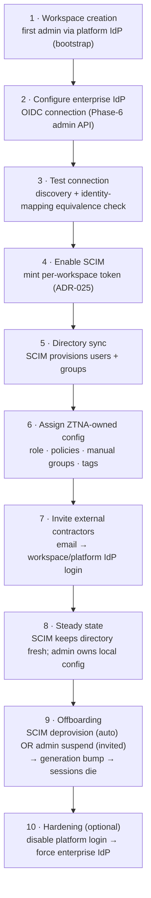
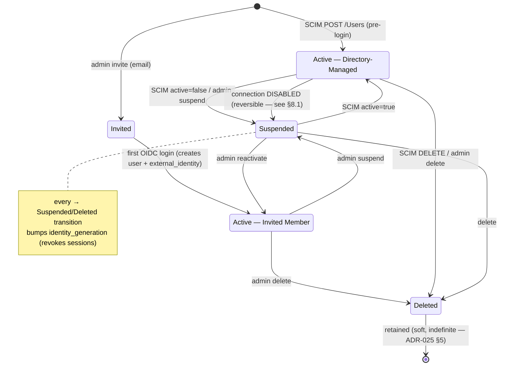

# Identity Lifecycle & Ownership — Design Review

> **Type:** Design review (not an ADR, not code). Input to possible updates of
> [[ADR-024-Identity-Linking-and-Provider-Migration]] and [[ADR-025-SCIM-Directory-Synchronization]].
> **Date:** 2026-08-06 · **Scope:** administrator experience + user lifecycle across OIDC + SCIM +
> invitations, before PENDING-05 implementation. **Status:** for discussion.
> **Frozen baseline:** [[Identity-Architecture-v1.0]].

---

## 0. Executive summary — the honest recommendations

1. **The two-source model (Directory-Managed + Invited) with no local users is correct and matches the
   market.** Twingate, Entra, and Cloudflare all delegate authentication and distinguish an
   internal/directory identity from an external/invited one. Keep it. *One caveat:* every one of them
   keeps a **non-directory fallback** (Cloudflare's one-time-PIN, our platform IdP + break-glass) —
   don't remove ours.
2. **Contractor → employee: DEFER explicit conversion past V1.** Ship *separate accounts* (current
   direction). Add one cheap safety net in V1: **duplicate-email *detection* surfaced to admins**
   (a warning, never an automatic merge).
3. **Multiple external_identities per canonical user: the schema already allows it — do NOT turn on
   linking logic in V1.** The moment a user has two identities from two connections, you are forced to
   answer *"which connection owns this user's lifecycle?"* — i.e. you must build a **source-of-authority**
   model (Okta calls it *mastering*, Entra calls it *source of authority*). That arbitration is the real
   cost, and it is not justified for a rare conversion case in V1.
4. **Introduce the *concept* of source-of-authority now, even though V1 only ever has one identity per
   user.** It makes ownership unambiguous today and is the prerequisite for safe linking later.
5. **Blind spots to fix in the ADRs before implementation** (§8):
   - **Connection removal needs a lifecycle** `ACTIVE → DISABLED → DELETED` — **DISABLE** suspends users
     reversibly; **DELETE** is guarded (0 users or typed confirmation). *Not* a silent mass-suspend.
   - **SCIM-disabled = silent stale access** → an **Identity Health** signal (🟢/🟡/🔴) the dashboard can't hide.
   - **Duplicate active login paths** → duplicate-email *detection* + a **Workspace Mode** (`Hybrid` /
     `Enterprise-Managed`) that expresses intent and auto-disables platform login.
   - **Email stays out of all logic** — SCIM does **not** fulfill invites (invites expire by TTL); this
     preserves ADR-024's *"email is never identity."*
   - **Directory Sync Instance ID** so disable→re-enable reconnects reconcile cleanly.

The rest of this document backs these up. *(Revised 2026-08-06 after design-review feedback: connection
lifecycle replaces raw delete-suspend; SCIM no longer touches invites; added sync-instance + workspace mode.)*

---

## 1. The two-source model (and "no local users")

Two — and only two — kinds of principal, both authenticated by an external OIDC IdP:

| | **Directory-Managed** | **Invited Member** |
| --- | --- | --- |
| Origin | SCIM push from enterprise directory | Admin invite by email |
| Created by | SCIM (`POST /Users`), before first login | First OIDC login after accepting invite |
| Authenticates via | the workspace's enterprise IdP | any offered IdP (workspace or platform/bootstrap) |
| Directory attributes | **read-only in Zecurity** ("Managed by …") | editable locally (no directory owns them) |
| Lifecycle owner | the directory (via SCIM) | Zecurity admin |
| Typical subject | employees | contractors / external collaborators |

**"No local users" is the right principle** — no passwords, no reset flows, no credential storage,
authentication always delegated. This is exactly Twingate's posture. **The one thing to preserve** is a
delegated-but-non-directory fallback so a workspace can't lock itself out — which we already have
(platform IdP + `IDP_BREAK_GLASS_EMAILS`, ADR-024 §5). Cloudflare's one-time-PIN is the same idea by a
different mechanism.

---

## 2. Administrator journey (end to end)

Two things worth calling out on this journey:
- **Step 1 vs Step 5 — the first admin.** SCIM only ever provisions **members**; role is Zecurity-owned
  (§3). So the *first* administrator of a directory-managed workspace must come from the bootstrap path
  (platform IdP / break-glass), not from SCIM. Document this or admins will ask "why is everyone a
  member?"
- **Step 10 closes the dual-path.** Once an enterprise IdP + SCIM are the source of truth, disabling
  platform login (Phase-7 toggle) is what removes the *contractor could also log in via Google* path
  (§8, blind spot 3). The toggle isn't just lockout-prevention — it's a lifecycle-hygiene tool.

---

## 3. Ownership model (affirmed, with the enforcement point)

Unchanged from ADR-025 §4 and validated by the market (Okta *profile mastering*: an IDP-mastered
profile "can only be updated by the IDP"). The rule: **the directory owns what it manages; Zecurity owns
what only Zecurity knows.**

| Field class | Owner | Enforcement |
| --- | --- | --- |
| Directory attributes (display name, email, department, title, active) of a SCIM user | Directory (SCIM) | **GraphQL mutations reject edits**; UI shows *"Managed by Google Workspace / Microsoft Entra"* and disables the field |
| SCIM group membership | Directory | local edits rejected |
| ZTNA role, resource policies, emergency access, tags, notes, manual-group membership | Zecurity (admin) | editable; SCIM never touches |

The enforcement point matters: **reject at the mutation layer**, not just grey-out in the UI — a
directory-owned field must be un-writable through the API, or the "no conflict" guarantee is only
cosmetic.

**Groups** carry `origin ∈ {manual, scim, system}` (+ `external_id`). Display name is *not* an
identifier: a `manual` "Engineering" and a `scim` "Engineering" are distinct objects, no auto-merge.
(Corroborated as the safe choice — see JumpCloud's email-keyed sync in §7 for the opposite, fragile,
approach.)

---

## 4. User lifecycle state machine

- `Invited` is a **membership** state (`workspace_members.status`) with *no `users` row yet* — the user
  materializes at first login. `Active`, `Suspended`, `Deleted` are `users.status`.
- **Provenance (`provisioned_by ∈ {jit, scim, manual}`) is orthogonal to state** — it decides *who may
  drive* the transitions (directory vs admin), per the ownership model.
- `Deleted` is terminal and retained indefinitely in V1. Whether a later SCIM re-provision *revives* a
  soft-deleted user or creates fresh is an open question (lean: revive same canonical user if the
  Canonical Identity Key matches — it's the same identity).

---

## 5. Scenarios

**Scenario 1 — Alice (employee).** SCIM provisions → OIDC login resolves the existing Canonical Identity
Key → Principal. ✅ Works exactly as designed.

**Scenario 2 — Barath (contractor).** No directory account; invited by email; authenticates via platform
Google; identity pipeline creates an Invited Member. ✅ Works. (Twingate does this exact thing — "users
with social logins manually added by an admin … for external parties like contractors.")

**Scenario 3 — Barath becomes an employee.** HR creates `barath@company.com` in Google Workspace; SCIM
provisions a *directory-managed* user through the enterprise connection. Now **two canonical users exist
for one human**:

| | Contractor account | Employee account |
| --- | --- | --- |
| Connection | platform-google | workspace-enterprise |
| Canonical Identity Key | e.g. `123` | e.g. `ABC` (≠ 123) |
| Origin | invited | directory-managed |
| Same email? | yes | yes — but email is **not** the key |

Per the no-email-merge invariant they stay separate. **That is correct and safe — but it is not
"done".** It leaves a duplicate and a dual login path (§8.3). The question is what, if anything, to do
about it.

---

## 6. The central question — one vs many identities per user

The schema (`external_identities` many-to-one → `users`) **already permits** a canonical user to own
multiple external identities. What's missing is *linking logic* — today the Linker always JIT-creates on
a resolver miss; it never attaches a new identity to an existing user.

Enabling multi-identity is not free. Consider Barath post-link (one user, two identities):

- The **employee** identity (SCIM) says `active=false` when he's offboarded as an employee.
- The **contractor** identity (platform-google) is still active.
- **Which one governs the user's lifecycle?** Without an answer, an offboarded employee can still log in
  via the contractor path — a security hole.

So **multi-identity forces a `source_of_authority` decision per user** — the single identity/connection
that owns lifecycle and directory attributes. This is precisely Okta's *profile mastering* and Entra's
*source of authority*. It is a real feature, not a flag.

**Recommendation:**
- **V1:** exactly one authoritative external_identity per canonical user (which is what "never link"
  already gives you). Introduce `users.source_of_authority` now — even if it always equals that one
  identity's connection — so ownership is explicit and the seam exists.
- **Post-V1:** an **explicit, admin-initiated, audited "Link identities / Convert" workflow** that
  attaches a second identity and sets/keeps a single source-of-authority. Never automatic.

---

## 7. Enterprise comparison (documented behavior vs inference)

> **[Documented]** = stated in the product's own docs (sources at the end). **[Inference]** = my
> architectural reading, clearly marked.

**Twingate** — [Documented] When an IdP is connected, users sync from it (SCIM) and are **read-only in
the Twingate console**; create/deactivate come from the IdP. [Documented] Twingate *also* lets admins
**manually add social-login users** (Google/LinkedIn) explicitly "for external parties like contractors
who don't have accounts in your IdP." No local passwords. → **This is almost exactly our two-source
model.** [Inference] Contractor vs employee is expressed as *manually-added vs IdP-synced*, and
conversion isn't automatic.

**Cloudflare Access** — [Documented] **One-Time PIN** is a first-class login method *as an alternative to
an IdP* (email PIN, single-use, 10-min). [Documented] "If a user authenticates via IdP but later via a
different method (OTP), Access no longer evaluates the user's IdP group memberships." → **direct
corroboration of our "groups are hints, valid only in IdP-based auth" invariant.** [Inference] Cloudflare
evaluates identity *per session against policy* rather than maintaining a rich persistent account
lifecycle, so "contractor→employee" is less of an object-lifecycle question there.

**Okta Workforce** — [Documented] **Profile mastering / sourcing**: an IDP-mastered profile "can only be
updated by the IDP" — our ownership model, by another name. [Documented] **Matching rules** ("imported
user is an exact match to Okta user if …") let admins *configure* attribute-based matching on import.
[Documented] Running **SCIM + JIT concurrently is "generally not recommended … may lead to conflicts
regarding user profile data control."** → **Okta itself warns about the exact dual-source hazard we're
designing around.** [Inference] Their answer is *configured* matching + a single master, not silent
merge — same spirit as our proposed explicit linking + source-of-authority.

**Microsoft Entra ID** — [Documented] Distinct `UserType`: **Member** (internal employee, authenticates
internally) vs **Guest** (B2B external collaborator / contractor, a separate external identity).
[Documented] **Guest→Member conversion exists but is an explicit admin action** (edit `UserType` in the
admin center or PowerShell) — **not automatic**. → **Strong precedent for: separate object types for
contractor vs employee, with deliberate admin conversion.** Our "two users + optional explicit convert"
mirrors this.

**JumpCloud** — [Documented] Syncs users from Google Workspace / other directories via Cloud Directory
or SCIM; identities can be mastered in the external IdP. [Documented] **"Directory integrations utilize
the user's email address as the unique identifier for synchronization"** (with domain-mapping caveats).
→ **The counter-example:** JumpCloud *does* key sync on **email**. That's pragmatic for a directory
product but carries exactly the fragility (domain/email changes, collisions) our `(connection, subject)`
key avoids. [Inference] We are deliberately stricter than JumpCloud here, and should stay that way.

**Cross-product synthesis:**
- **Local users:** none of them require passwords; all delegate. Cloudflare (OTP) and we (platform/break-
  glass) keep a non-directory fallback. ✅ our stance is mainstream.
- **Contractor vs employee:** separate identities/objects is the norm (Entra guest/member; Twingate
  manual/synced). Conversion is **explicit and admin-driven** everywhere it exists (Entra, Okta matching)
  — **nobody auto-merges by email except email-keyed sync products (JumpCloud), which accept the
  fragility.** ✅ our no-email-merge + (future) explicit-link is the stronger design.
- **Ownership:** Okta mastering ≈ our ownership model. ✅

---

## 8. Architectural weaknesses / blind spots (the challenges)

### 8.1 Connection removal needs a *lifecycle*, not a silent mass-suspend
`external_identities.connection_id → identity_connections ON DELETE CASCADE`. Deleting a connection
deletes its identity links but **leaves the `users` rows** (`status = active`) with **no login path** —
active-but-unloginnable orphans. So the model must transition the users. **But the fix is NOT
"delete → suspend N users"** — one mistaken click suspending 1,000 employees is its own disaster.

**Decision — introduce connection lifecycle states: `ACTIVE → DISABLED → DELETED`.**

- **DISABLE (reversible)** is the real off-switch: new logins fail, sessions revoked, **linked users
  suspended**. Re-enabling the connection restores them. This is where mass state-change lives, and it is
  *undoable*.
- **DELETE (guarded, rare, terminal)** is permitted only when **`linked_users == 0`**, or behind an
  **explicit typed confirmation** ("This affects 1,000 users. Type DELETE"). Only then does the cascade run.

Suspension therefore happens through the reversible DISABLE path — never as a silent side effect of a
raw delete.

### 8.2 SCIM disabled → silent stale access (security)
SCIM is the deprovision channel. If SCIM is *disabled* but OIDC stays *enabled*, and an employee is fired
in the directory, Zecurity keeps them `active` (OIDC still resolves) until a human notices. **SCIM
availability = deprovision timeliness.** **Decision:** surface it loudly as an **Identity Health** status
the dashboard cannot hide:

> 🟢 **Healthy** — SCIM syncing · 🟡 **SCIM delayed** — no sync in _N_ · 🔴 **SCIM disconnected** — deprovisioning is not happening

Track `last_sync_at` per connection, alert on 🟡/🔴. (A future pull-based re-check at login is the
stronger fix — ADR-025 §11.)

### 8.3 Duplicate *active login paths* for one human → Workspace Mode
Post-Scenario-3, Barath can log in via **either** the contractor (platform-google) or employee
(enterprise) path, landing in **different canonical users with different access**. The contractor account
may carry stale policies. **Decision:**
- (a) **duplicate-email *detection*** as an admin surface — "2 accounts share barath@company.com; review"
  — never an auto-merge;
- (b) express the Phase-7 platform toggle as an intent-level **Workspace Mode**, not a raw switch:
  **`Hybrid` → `Enterprise-Managed`**. Choosing *Enterprise-Managed* **auto-disables platform login**.
  The admin isn't "turning off Google" — they're declaring *"my company now owns all identities,"* which
  is the actual intent and collapses the dual path. (Same underlying `platform_login_enabled`; better
  mental model + audit trail.)

### 8.4 Invite ↔ SCIM email overlap — keep email OUT of the logic
Admin invites `barath@`; SCIM later provisions `barath@`. It's tempting to have SCIM *fulfill* the
pending invite. **Reject that.** Matching a SCIM user to a pending invite **by email** — even "just for
membership" — reintroduces email as decision logic, directly contradicting ADR-024's *"email is never
identity."* **Decision:** **SCIM never reads invites.** It creates its member independently; a pending
invite simply **expires by its own TTL**; email stays *notification*, never *logic*. If both a SCIM user
and an invited user get created for one human, that is the duplicate-**detection** case (§8.3), resolved
by an admin — not by hidden email coupling. Simpler, no surprise behavior, consistent with ADR-024.

### 8.5 Reconnect ambiguity → Directory Sync Instance ID
Admin enables SCIM (500 users appear), later disables it (users remain), then **re-enables** it months
later. How do we tell *"still in the current directory"* from *"left over from the previous import"*?
**Decision:** every SCIM connect opens a **Sync Instance (UUID)**, and every provisioned object records
the `sync_instance_id` that created / last-touched it. On reconnect a new instance starts, so reconciling
current-vs-stale objects (and auditing "who imported this, when") becomes trivial instead of guesswork.

### 8.6 Minor
- **First directory admin** must be bootstrapped (SCIM only makes members) — document.
- **Access provenance:** effective access is the union of manual + SCIM groups; admins need "*why* does
  this user have access?" (which group granted it). Nice-to-have.

---

## 9. Conflict matrix

| Conflict | Resolution | Rationale |
| --- | --- | --- |
| **SCIM vs manual edit** of a directory-owned field | Manual edit **rejected at the mutation layer**; field read-only ("Managed by …") | Ownership model; "no conflict because no edit is possible" |
| **SCIM vs manual** on a Zecurity-owned field | Manual wins; SCIM never writes it | Zecurity owns what only it knows |
| **Duplicate email** (two connections, same email) | **Two users; never merge.** V1 adds admin-visible **detection/warning** | No-email-merge invariant (ADR-024); email ≠ proof of identity |
| **Duplicate display name** | Allowed, no action | Display name is not an identifier |
| **Duplicate group name** across origins | Distinct objects by `(origin, external_id)`; no merge | Group-origin model (ADR-025 §6) |
| **Contractor → employee** | V1: two users (+ detection). Post-V1: explicit admin link/convert + source-of-authority | Entra guest→member precedent; no auto-merge |
| **SCIM disabled** (OIDC on) | Directory users go **sync-stale**; login still works; **Identity Health** shows 🟡/🔴 + alert | Availability separation; but flag the deprovision-timeliness gap (§8.2) |
| **Connection DISABLED** | New logins fail, sessions revoked, **linked users suspended** — reversible on re-enable | The safe, undoable off-switch (§8.1) |
| **Connection DELETED** | Allowed only when `linked_users == 0` or via **typed confirmation**; then cascade | Never silently mass-suspend on a mis-click (§8.1) |
| **SCIM reconnect** after a disable | New **Sync Instance ID**; objects reconciled current-vs-stale by instance | Clean reconnect + audit (§8.5) |

---

## 10. Proposed changes to the ADRs (if accepted)

1. **ADR-024/025 — connection lifecycle** `ACTIVE → DISABLED → DELETED`: **DISABLE** suspends linked users
   (reversible); **DELETE** is guarded (`linked_users == 0` or typed confirmation). No silent mass-suspend. *(§8.1)*
2. **ADR-025 — source-of-authority:** add `users.source_of_authority`; V1 has exactly one authoritative
   identity per user; multi-identity linking requires it. *(§6)*
3. **ADR-025 — SCIM does NOT fulfill invites.** SCIM never reads invites; pending invites expire by their
   own TTL; email stays notification-only. Removes email from all decision logic. *(§8.4)*
4. **ADR-025 — Identity Health** surface (🟢/🟡/🔴, `last_sync_at`) + stale-access caveat. *(§8.2)*
5. **ADR-024 — duplicate-email detection** (warn, never merge) as the V1 net for Scenario 3. *(§8.3)*
6. **ADR-025 — Directory Sync Instance ID** on provisioned objects for clean reconnects + audit. *(§8.5)*
7. **ADR-025 — Workspace Mode** (`Hybrid` / `Enterprise-Managed`) as the intent-level framing of
   `platform_login_enabled`; Enterprise-Managed auto-disables platform login. *(§8.3)*
8. **Ownership enforcement** is explicitly at the **mutation layer**, not UI-only. *(§3)*
9. **New (future) ADR — Contractor↔Employee conversion / explicit identity linking**, deferred past V1,
   built on source-of-authority. *(§6)*

Decisions 1–8 are worth folding in **before** PENDING-05 implementation. Decision 9 is a separate, later ADR.

---

## Sources

- Twingate — [Users](https://www.twingate.com/docs/users), [Identity Providers](https://www.twingate.com/docs/identity-providers), [SCIM Provisioning API](https://www.twingate.com/docs/scim-provisioning-api)
- Cloudflare Access — [One-time PIN login](https://developers.cloudflare.com/cloudflare-one/integrations/identity-providers/one-time-pin/)
- Okta — [Profile sourcing](https://help.okta.com/en-us/content/topics/users-groups-profiles/usgp-about-profile-sourcing.htm), [JIT provisioning](https://help.okta.com/en-us/content/topics/users-groups-profiles/usgp-add-users-jit.htm), [Understanding SCIM](https://developer.okta.com/docs/concepts/scim/)
- Microsoft Entra — [B2B guest user properties (UserType Member/Guest, conversion)](https://learn.microsoft.com/en-us/entra/external-id/user-properties)
- JumpCloud — [Google Workspace integration](https://jumpcloud.com/support/google-workspace-integration-overview), [Google Workspace sync](https://jumpcloud.com/support/google-workspace-sync)
