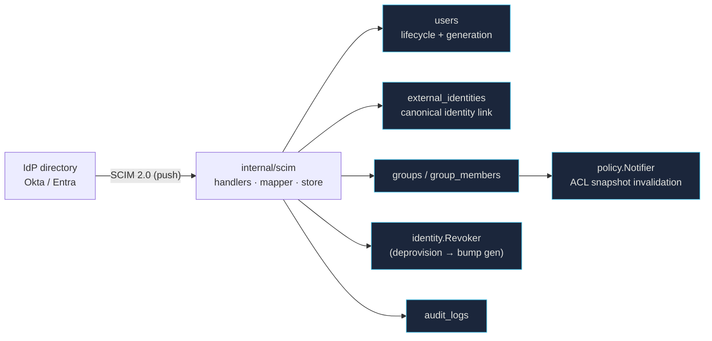
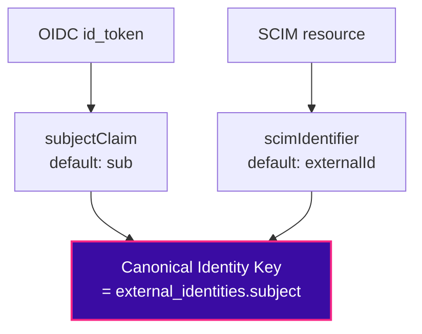

# ADR-025 — SCIM Directory Synchronization

> **Status: PROPOSED (2026-08-06).** The product-behavior decisions behind PENDING-05. On team
> ratification, flip to ACCEPTED and it governs the implementation. Governed by
> [[ADR-023-Identity-Philosophy]]; builds directly on the identity model of
> [[ADR-024-Identity-Linking-and-Provider-Migration]] and the frozen
> [[Identity-Architecture-v1.0]]. Wrong provisioning behavior — especially failed deprovisioning — is
> a **security incident** (stale access to a ZTNA plane), not a bug; hence an ADR.

## Context / Problem

Login is now provider-agnostic (PENDING-04), but the **user set and group membership are not
directory-driven**. Users are created just-in-time at first login; `groups` / `group_members` /
`access_rules` (migration `012_groups_acl.sql`) are edited **by hand**. So when an employee is
offboarded in Okta/Entra, **nothing here removes their access** — an admin must notice and act. That
is both a security gap (stale access) and admin toil. We need continuous, directory-driven
provisioning and — critically — **deprovisioning**.

Per PENDING-05, with generic OIDC (not a broker) landed in PENDING-04, the answer is **SCIM 2.0
(Option A)**: a standard REST endpoint that IdPs push Users and Groups into. This ADR fixes the
behavior an implementer must not invent.

**What SCIM is, in one line:** the *push/continuous* write-path into the Identity plane, complementing
OIDC's *pull/at-login* path. Both converge on the same canonical model (`external_identities` →
`users` → `group_members`); SCIM also drives lifecycle transitions and, on deprovision, **reuses the
Phase-5 `identity.Revoker`** to kill sessions immediately.

---

## Decision

### 1. Goals & Non-Goals

**Goals**
- SCIM 2.0 server for **Users** and **Groups** (create / read / update / deactivate / delete).
- Near-real-time **deprovisioning** that suspends/deletes a user *and revokes their sessions*.
- Keep `groups` / `group_members` fresh from the directory so the policy engine reads accurate
  membership — making [[Identity-Architecture-v1.0]] invariant #10 (*groups are hints, not
  authorization*) operationally true.
- Per-workspace, tenant-isolated, auditable.

**Non-Goals (this iteration)**
- Full SCIM 2.0 surface — no `/Me`, no bulk operations, no enterprise-user schema extensions beyond
  what Okta/Entra require, no complex `filter` grammar (only `eq` on `userName`/`externalId`).
- No pull-based sync (Google Directory / MS Graph) — deferred (§11).
- No broker-owned SCIM — only relevant if a broker is later adopted (§11).
- No local editing of directory-owned attributes (see §4 — the IdP is the system of record).

### 2. Architecture

SCIM is a **second write-path into the Identity plane**, parallel to the login pipeline, converging on
the same canonical model. It does **not** touch Authentication (no login) or mint sessions — but it
*triggers* session revocation on deprovision.



**Endpoints** (tenant scoped by the presented token, §7): `/scim/v2/Users`,
`/scim/v2/Groups`, `/scim/v2/ServiceProviderConfig`, `/scim/v2/ResourceTypes`, `/scim/v2/Schemas`.
Standard SCIM verbs: `POST`, `GET`, `PUT`, `PATCH`, `DELETE`. RFC 7643 (schema) + 7644 (protocol).

**Reused, not rebuilt:** `internal/identity` (Resolver/Linker/lifecycle/**Revoker**), `groups` /
`group_members`, `policy.Notifier`, `audit_logs`. **New:** `internal/scim`, `scim_tokens`, a few
columns (§10), and a GraphQL admin surface to mint/rotate the token.

### 3. Identity Mapping — the Canonical Identity Key

**We do NOT hardcode `externalId ≡ sub`.** Providers disagree on the stable user identifier:
Okta uses `sub`/`id`, Entra uses `oid`/`objectId`, some expose `immutableId`, and a SCIM server's
`externalId` is *not necessarily* the same value as the OIDC `sub`. Hardcoding the equivalence would
silently split or merge identities on some IdPs.

Instead, identity mapping is **provider-specific and configurable per connection**. Both the OIDC
login path and the SCIM path resolve their provider identifier to a single **Canonical Identity Key** —
the value stored in `external_identities.subject` (the ADR-024 linking key).

> **Why "Identity Key", not "Subject":** the name is deliberately protocol-neutral. Future adapters
> (SAML, LDAP, Kerberos, a broker) may expose no attribute literally called `sub`. The *concept* is
> the stable per-connection identifier; the *storage column* keeps its existing name
> `external_identities.subject` (no schema churn).



*Both extractors (`subjectClaim`, `scimIdentifier`) are configured per `identity_connections`. The invariant is that they resolve to the **same** Canonical Identity Key for the same person.*

- **`subjectClaim`** (default `sub`) — the OIDC claim the login adapter reads to produce
  `AuthenticationContext.Subject`. Configurable per connection (e.g. Entra → `oid`).
- **`scimIdentifier`** (default `externalId`) — the SCIM attribute the provisioning path reads to
  produce the same Canonical Identity Key.

**Invariant:** for a given connection, `subjectClaim(login)` and `scimIdentifier(provisioning)` MUST
resolve to the **same value** for the same person. That is a per-connection configuration
responsibility (validated at connection setup and by `testIdpConnection`), *not* an assumption baked
into code. Get it right and a SCIM-provisioned user and their later OIDC login converge on the **same
`external_identities` row** — with no email-merge, honoring ADR-024.

These two are **security-critical**, so they are first-class columns on `identity_connections` (§10),
distinct from the cosmetic `claim_mappings` JSONB (name/email/groups display claims).

**Mapping validation is active, not passive.** `testIdpConnection` must do more than reach discovery:
where the IdP allows it, it performs a **round-trip equivalence check** — that the OIDC `subjectClaim`
and the SCIM `scimIdentifier` resolve to the *same logical user* (e.g. compare a known user's `sub`
against their SCIM `externalId`, or provision-and-read a probe user). If the equivalence cannot be
proven, the connection is flagged with a **loud warning and SCIM stays disabled** until an admin
explicitly confirms. This is because a misconfigured mapping silently **splits or merges accounts**,
and that damage is extremely hard to repair after users and links already exist.

### 4. Ownership Model

> **Governing principle — identity is immutable.** Once a Principal exists for an identity, SCIM may
> change its **lifecycle** (active → suspended → deleted) and its **attributes** (name, groups), but it
> **never changes the principal's identity** — the Canonical Identity Key is fixed at creation.
> Provisioning updates a user; it never re-points one identity at a different person.

The question the naive design misses: SCIM creates Alice; an admin manually edits her Display Name;
the next sync runs — **who wins?** Without a rule this produces endless confusion. Every attribute has
exactly one **owner**.

| Attribute class | Owner | On conflict |
| --- | --- | --- |
| **Directory attributes** of a SCIM-managed user (name, email, department, title, active) | **SCIM (directory is system of record)** | SCIM overwrites; these fields are **read-only locally** (the UI disables them — "managed in your directory"). |
| **SCIM group membership** (member of a `scim`-origin group) | **SCIM** | SCIM is authoritative; local edits rejected. |
| **Zecurity-local attributes** (platform `role`, membership in `manual`-origin groups, device/policy assignments) | **Manual (admin)** | SCIM never touches them. |
| A user created manually (never seen via SCIM) | **Manual** | SCIM only takes over if/when it explicitly provisions that identity. |

Provenance is **recorded, not inferred**: `users.provisioned_by ∈ {jit, scim, manual}` and, for
groups, `groups.origin` (§6). The rule in one sentence: **the directory owns what the directory
manages; Zecurity owns what only Zecurity knows.** No silent field-level tug-of-war, no "pin this
field" special-casing in v1 — an admin who needs to change a directory-owned attribute changes it *in
the directory*. This matches enterprise expectations (Okta/Entra is the system of record) and keeps
the model explainable.

### 5. Lifecycle

SCIM drives canonical-user lifecycle (reusing `users.status` + `identity_generation` from PENDING-04
— no new states needed).

| SCIM operation | Effect | Session impact |
| --- | --- | --- |
| `POST /Users` (or first `PATCH`) | JIT-create canonical user (via the identity Linker path) + `external_identities` link; `status = active` | — |
| `PUT` / `PATCH` (attributes, groups) | update SCIM-owned attributes + membership; notify policy | — |
| `PATCH active=false` | **Suspend** (`status = suspended`) | `Revoker.BumpGeneration` → sessions die at next refresh (≤15m) + refresh session dropped |
| `DELETE` | **Delete** (`status = deleted`, soft) + remove `group_members` | `Revoker.BumpGeneration` |

**Deprovision is the security-critical path** and reuses exactly the Phase-5 revocation machinery.
**Device-cert revocation tie-in:** a hard deprovision (`DELETE`, and optionally `active=false`) SHOULD
also revoke the user's device certificates — this integrates with **PENDING-02** (CRL/OCSP) and
**PENDING-13** (device lifecycle). Flagged as an integration point, not re-specified here.

**Soft-delete retention (explicit):** a `deleted` user is retained **indefinitely** in v1 — its
`external_identities` link and audit trail are preserved for forensics and for clean reactivation on
rehire. There is **no automatic hard purge**. Permanent erasure (e.g. GDPR right-to-erasure) is an
explicit, audited admin action; a scheduled retention/purge policy is a future extension (§11).
Rationale: for a ZTNA plane, losing the identity→access audit trail is worse than keeping a tombstoned
row. The deleted user cannot authenticate (lifecycle gate) and holds no sessions (revoked), so the
tombstone is inert from a security standpoint.

### 6. Group Management

Groups now have **three origins**, made explicit so names never collide ambiguously:

| Origin | Meaning | Membership authority |
| --- | --- | --- |
| `manual` | Admin-created in Zecurity | Admin |
| `scim` | Pushed by the directory | SCIM (directory) |
| `system` | Platform-reserved (e.g. built-ins) | Platform |

`groups` gains `origin` + `external_id` (the SCIM group id). A `manual` "Engineering" and a `scim`
"Engineering" are **distinct rows** — resolved by `(workspace_id, origin, external_id/name)`, never
by display name alone. `access_rules` may reference either. SCIM-group membership is directory-
authoritative; manual-group membership stays admin-authoritative. This removes the "which Engineering?"
ambiguity by construction.

### 7. Authentication

SCIM requests authenticate with a **per-workspace bearer token** — machine-to-machine, *not* a user
JWT. Modeled exactly like an API key:

`scim_tokens`: `id`, `workspace_id`, `token_hash` (**hash only — never plaintext**), `label`,
`created_at`, `created_by`, `last_used_at`, `expires_at`, `revoked_at`.

- Presented as `Authorization: Bearer <token>`; looked up by hash; **every operation is tenant-scoped
  to the token's `workspace_id`** (Okta of workspace A can never touch workspace B).
- Minted/rotated via the admin GraphQL API (mirrors the Phase-6 IdP-connection admin). The plaintext
  is shown **once** at creation, then only the hash persists.
- **Hash algorithm (explicit):** the token is a 256-bit random secret; `token_hash` is **SHA-256** of
  the raw token. High entropy means no salt or slow (password) hash is needed — this matches how
  personal-access tokens are stored, and lookup stays an indexed equality on the hash. *Hardening
  option (recommended):* **HMAC-SHA256** keyed by a server secret derived from `PKI_MASTER_SECRET`, so
  a bare database leak cannot be used to look tokens up. Pick one at implementation and record it.
- Rotation is immediate (old token invalid at once), audited (`scim.token.rotate`). Expiry supported.

### 8. Synchronization Semantics

- **RFC 7644 PATCH** (`add` / `remove` / `replace`) on Users and Groups; `PUT` is an idempotent full
  replace. All operations idempotent and retry-safe.
- **Concurrency / replay:** a retried PATCH (Okta may send the same op several times) is safe by
  idempotency. Optimistic concurrency (SCIM `meta.version` / HTTP `ETag`) is **not required in v1**, but
  every resource response carries `meta.version` so `If-Match` can be enabled later **without a breaking
  change** — reserving the seam now, not building it.
- **Eventual consistency / ordering:** SCIM is best-effort and may arrive out of order (e.g. a group
  member add for a not-yet-provisioned user). Respond with correct SCIM status codes (`404`, `409`)
  so the IdP retries; never partially corrupt state — each op is transactional.
- **Filtering:** minimal — `eq` on `userName` / `externalId` only (IdPs use it to check existence
  before create). Anything else → `400` with a proper SCIM error.
- **Responses & errors:** RFC-compliant SCIM schemas and error envelopes (`urn:ietf:params:scim:...`).
- **Membership changes** call `policy.Notifier.NotifyPolicyChange` to invalidate the ACL snapshot,
  identical to a manual group edit today.
- **Audit:** every mutation writes `audit_logs` (`scim.user.provision`, `scim.user.deprovision`,
  `scim.group.sync`, `scim.token.rotate`, …).

### 9. Failure Philosophy

Fail-closed and fail-safe, chosen per concern (consistent with the frozen architecture's
availability separation):

| Condition | Behavior |
| --- | --- |
| SCIM endpoint down / erroring | **Login still works.** SCIM is provisioning, not the auth path — an outage must never lock a workspace out. |
| Bad / expired / revoked SCIM token | `401`, fail-closed. |
| A sync op fails mid-flight | Transactional per-op; return a retryable SCIM error; the IdP retries. No partial user state. |
| Deprovision processed | **Durable and irreversible by outage** — once a suspend/delete + generation bump commits, a later SCIM hiccup must not silently un-suspend. Prefer to over-revoke than to miss. |
| Ambiguous identity mapping (misconfigured `subjectClaim`/`scimIdentifier`) | Reject at connection setup / `testIdpConnection`, not at runtime. |

### 10. Data Model (concrete)

```sql
-- identity_connections: first-class, security-critical mapping (defaults preserve today's behavior)
ALTER TABLE identity_connections ADD COLUMN subject_claim   TEXT NOT NULL DEFAULT 'sub';
ALTER TABLE identity_connections ADD COLUMN scim_identifier TEXT NOT NULL DEFAULT 'externalId';
ALTER TABLE identity_connections ADD COLUMN scim_enabled    BOOLEAN NOT NULL DEFAULT FALSE;

-- users: provenance for the ownership model (status + identity_generation already exist)
ALTER TABLE users ADD COLUMN provisioned_by TEXT NOT NULL DEFAULT 'jit'
    CHECK (provisioned_by IN ('jit','scim','manual'));

-- groups: origin + external id so directory groups never collide with manual ones
ALTER TABLE groups ADD COLUMN origin      TEXT NOT NULL DEFAULT 'manual'
    CHECK (origin IN ('manual','scim','system'));
ALTER TABLE groups ADD COLUMN external_id TEXT;  -- SCIM group id (NULL for manual/system)

-- per-workspace SCIM bearer tokens (SHA-256 of a 256-bit random secret; never plaintext)
CREATE TABLE scim_tokens (
    id           UUID PRIMARY KEY DEFAULT gen_random_uuid(),
    workspace_id UUID NOT NULL REFERENCES workspaces(id) ON DELETE CASCADE,
    token_hash   TEXT NOT NULL,   -- SHA-256 (or HMAC-SHA256 keyed by PKI_MASTER_SECRET)
    label        TEXT,
    created_by   UUID,
    created_at   TIMESTAMPTZ NOT NULL DEFAULT NOW(),
    last_used_at TIMESTAMPTZ,
    expires_at   TIMESTAMPTZ,
    revoked_at   TIMESTAMPTZ
);
```

`external_identities` is **unchanged** — SCIM writes it at provision time with
`subject = <value of scimIdentifier>`, exactly the Canonical Identity Key a later login resolves.

### 11. Future Extensions

- **Pull-based sync** (Google Directory / MS Graph) for directories without SCIM (PENDING-05 Option B).
- **Broker-owned SCIM** (WorkOS/Auth0/Keycloak/Dex) if a broker is ever adopted — the controller would
  consume normalized events; the `internal/scim` mapper stays the same shape.
- **Nested / dynamic groups**, group renaming reconciliation.
- **HR-driven provisioning** (Workday) upstream of the IdP.
- **Field-level ownership overrides** (pinning a directory attribute to manual) — deliberately *out* of
  v1 to keep the ownership model explainable.

---

## Consequences

**Positive**
- Offboarding becomes automatic and *immediate* — a `DELETE`/`active=false` from the directory kills
  sessions via the existing Revoker. Closes the stale-access security gap.
- The policy engine finally reads directory-accurate membership; "groups are hints" is real.
- Reuses the entire PENDING-04 spine (identity key, lifecycle, revocation, audit) — small new surface.

**Costs / risks**
- SCIM's PATCH + eventual-consistency semantics are fiddly; correctness needs a real conformance test
  matrix (Okta + Entra both).
- The `subjectClaim`/`scimIdentifier` mapping is a **setup-time footgun** if misconfigured (split or
  merged identities). Mitigated by the **active round-trip equivalence check** at connection setup
  (§3 — SCIM stays disabled until proven), and by the fail-closed rule in §9.
- Directory-owned attributes being read-only locally is the correct model but must be clearly surfaced
  in the admin UI, or admins will be confused why they "can't edit" a field.

## Open Questions (for ratification)

- Exact device-cert revocation trigger on deprovision — `DELETE` only, or `active=false` too? (Ties to
  PENDING-02 / PENDING-13.)
- Do we reconcile a pre-existing manual group with an incoming SCIM group of the same name, or keep
  them strictly separate? (This ADR says **separate by origin**; revisit if admins ask to merge.)
- Token-hash function — plain **SHA-256** or **HMAC-SHA256** keyed by `PKI_MASTER_SECRET`? (§7 leans
  HMAC for defense against a bare DB leak; confirm at implementation.)

*(Settled in this revision: soft-delete retention = indefinite/no auto-purge (§5); token rotation =
immediate hard cut-over (§7); identity-mapping validation = active round-trip, fail-closed (§3).)*

---

## Relationship to other decisions

Builds on ADR-023 (planes), ADR-024 (linking key, no email-merge), and the frozen
[[Identity-Architecture-v1.0]] (Resolver/Linker/Revoker, invariants). Integrates with PENDING-02
(cert revocation) and PENDING-13 (device lifecycle) on the deprovision path. Independent of PENDING-06
(step-up), which consumes login-time `amr`/`acr`.
