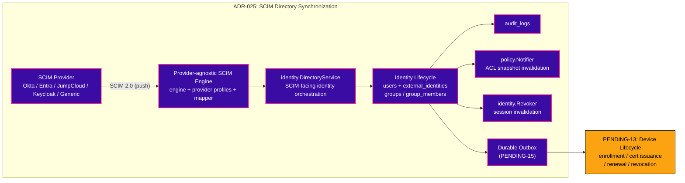
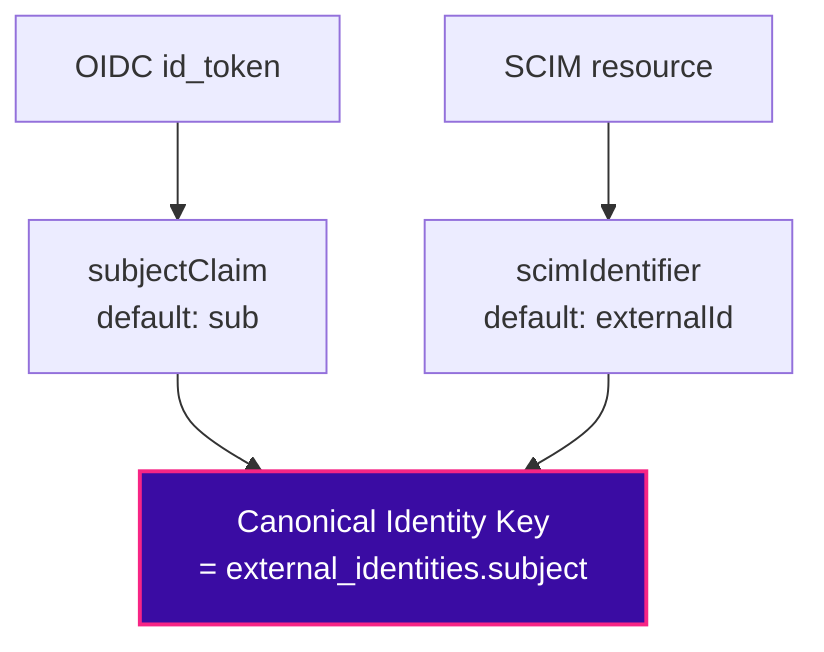

# ADR-025 — SCIM Directory Synchronization

> **Status: PROPOSED (2026-08-06).** The product-behavior decisions behind PENDING-05. On team
> ratification, flip to ACCEPTED and it governs the implementation. Governed by
> [[ADR-023-Identity-Philosophy]]; builds directly on the identity model of
> [[ADR-024-Identity-Linking-and-Provider-Migration]] and the frozen
> [[Identity-Architecture-v1.0]]. Wrong provisioning behavior — especially failed deprovisioning — is
> a **security incident** (stale access to a ZTNA plane), not a bug; hence an ADR.

## Context / Problem

Login is now provider-agnostic (PENDING-04), but the **user set and group membership are not
directory-driven**. Users are created just-in-time at first login; `groups` / `group_members` /
`access_rules` (migration `012_groups_acl.sql`) are edited **by hand**. So when an employee is
offboarded in Okta/Entra, **nothing here removes their access** — an admin must notice and act. That
is both a security gap (stale access) and admin toil. We need continuous, directory-driven
provisioning and — critically — **deprovisioning**.

Per PENDING-05, with generic OIDC (not a broker) landed in PENDING-04, the answer is **SCIM 2.0
(Option A)**: a standard REST endpoint that IdPs push Users and Groups into. This ADR fixes the
behavior an implementer must not invent.

**What SCIM is, in one line:** the *push/continuous* write-path into the Identity plane, complementing
OIDC's *pull/at-login* path. Both converge on the same canonical model (`external_identities` →
`users` → `group_members`); SCIM also drives lifecycle transitions and, on deprovision, **reuses the
Phase-5 `identity.Revoker`** to kill sessions immediately.

---

## Decision

### 1. Goals & Non-Goals

**Goals**
- SCIM 2.0 server for **Users** and **Groups** (create / read / update / deactivate / delete).
- Near-real-time **deprovisioning** that suspends/deletes a user *and revokes their sessions*.
- Keep `groups` / `group_members` fresh from the directory so the policy engine reads accurate
  membership — making [[Identity-Architecture-v1.0]] invariant #10 (*groups are hints, not
  authorization*) operationally true.
- Per-workspace, tenant-isolated, auditable.

**Non-Goals (this iteration)**
- Full SCIM 2.0 surface — no `/Me`, no bulk operations, no enterprise-user schema extensions beyond
  what Okta/Entra require, no complex `filter` grammar (only `eq` on `userName`/`externalId`).
- No pull-based sync (Google Directory / MS Graph) — deferred (§13).
- No broker-owned SCIM — only relevant if a broker is later adopted (§13).
- No local editing of directory-owned attributes (see §4 — the IdP is the system of record).

### 2. Architecture

SCIM is a **second write-path into the Identity plane**, parallel to the login pipeline, converging on
the same canonical model. It does **not** touch Authentication (no login) or mint sessions — but it
*triggers* session revocation on deprovision.



**The architecture is layered — SCIM does not directly invoke device or certificate
logic. Policy notification, audit, and session revocation are side-effects of the
identity lifecycle transaction, all committed atomically. Device-trust side-effects
are delivered only through the durable outbox:**

```text
SCIM Provider
    ↓
Provider-agnostic SCIM Engine
    ↓
identity.DirectoryService
    ↓
Identity Lifecycle
    ↓
Transactional lifecycle state
    ↓
audit log
policy.Notifier (ACL snapshot invalidation)
identity.Revoker (session invalidation)
    ↓
Durable Outbox (PENDING-15)
    ↓
PENDING-13 Device Lifecycle
    ↓
Device Trust / Certificates
```

**Ownership boundary (normative):**

```text
identity.Revoker
    → identity generation / session invalidation (immediate, synchronous)

PENDING-15
    → durable delivery of lifecycle side-effect events (retryable, async)

PENDING-13
    → device enrollment / certificate issuance / renewal / revocation / device trust
```

**ADR-025 owns** identity lifecycle decisions and the requirement to enqueue lifecycle
side-effect events. **PENDING-15 owns** generic durable outbox infrastructure.
**PENDING-13 owns** device enrollment, certificate issuance, certificate renewal,
certificate revocation, and device-trust implementation.

ADR-025 must **not directly invoke** certificate or device-management logic.**

**Endpoints** (workspace+connection scoped by the presented token, §7): `/scim/v2/Users`,
`/scim/v2/Groups`, `/scim/v2/ServiceProviderConfig`, `/scim/v2/ResourceTypes`, `/scim/v2/Schemas`.
Standard SCIM verbs: `POST`, `GET`, `PUT`, `PATCH`, `DELETE`. RFC 7643 (schema) + 7644 (protocol).

**Reused, not rebuilt:** `internal/identity` (Resolver/Linker/lifecycle/**Revoker**), `groups` /
`group_members`, `policy.Notifier`, `audit_logs`. **New:** `internal/scim`, `scim_tokens`,
`scim_identity_conflicts` table, a few columns (§12), and a GraphQL admin surface to mint/rotate the token.

---

### 3.1. Provider-Agnostic SCIM Engine

The SCIM engine is **provider-agnostic**. Okta, Entra, JumpCloud, Keycloak, and Generic
SCIM 2.0 all use the same engine — there is one code path for provisioning, lifecycle,
group management, and conflict resolution.

**Provider profiles** may contain:

* defaults (subject claim, identifier attribute, supported SCIM features)
* capability metadata (create/delete/PATCH support, pagination limits)
* attribute / identifier mappings (configurable per connection)
* supported schema extensions
* compatibility behavior (known IdP quirks)
* validation requirements (round-trip probe capabilities)

Provider profiles **must not** contain identity mutation business logic, and do **not**
create separate handler types:

```text
OktaHandler      ← DO NOT CREATE
EntraHandler     ← DO NOT CREATE
JumpCloudHandler ← DO NOT CREATE
KeycloakHandler  ← DO NOT CREATE
```

The model is a **built-in provider profile** plus **per-connection database configuration
overrides**:

```text
built-in provider profiles
        +
per-connection database configuration/overrides
```

A **Generic SCIM 2.0** profile is always available for any compliant provider not
covered by a built-in profile.

### 3. Identity Mapping — the Canonical Identity Key

We do NOT hardcode `externalId ≡ sub`. Providers disagree on the stable user identifier:
Okta uses `sub`/`id`, Entra uses `oid`/`objectId`, some expose `immutableId`, and a SCIM server's
`externalId` is *not necessarily* the same value as the OIDC `sub`. Hardcoding the equivalence would
silently split or merge identities on some IdPs.

Instead, identity mapping is **provider-specific and configurable per connection**. Both the OIDC
login path and the SCIM path resolve their provider identifier to a single **Canonical Identity Key** —
the value stored in `external_identities.subject` (the ADR-024 linking key).

> **Why "Identity Key", not "Subject":** the name is deliberately protocol-neutral. Future adapters
> (SAML, LDAP, Kerberos, a broker) may expose no attribute literally called `sub`. The *concept* is
> the stable per-connection identifier; the *storage column* keeps its existing name
> `external_identities.subject` (no schema churn).



*Both extractors (`subjectClaim`, `scimIdentifier`) are configured per `identity_connections`. The invariant is that they resolve to the **same** Canonical Identity Key for the same person.*

- **`subjectClaim`** (default `sub`) — the OIDC claim the login adapter reads to produce
  `AuthenticationContext.Subject`. Configurable per connection (e.g. Entra → `oid`).
- **`scimIdentifier`** (default `externalId`) — the SCIM attribute the provisioning path reads to
  produce the same Canonical Identity Key.

**Invariant:** for a given connection, `subjectClaim(login)` and `scimIdentifier(provisioning)` MUST
resolve to the **same value** for the same person. That is a per-connection configuration
responsibility (validated at connection setup and by `testIdpConnection`), *not* an assumption baked
into code. Get it right and a SCIM-provisioned user and their later OIDC login converge on the **same
`external_identities` row** — with no email-merge, honoring ADR-024.

These two are **security-critical**, so they are first-class columns on `identity_connections` (§12),
distinct from the cosmetic `claim_mappings` JSONB (name/email/groups display claims).

#### 3.1. Mapping Validation

**Mapping validation is active, not passive.** `testIdpConnection` must do more than reach discovery:
where the IdP allows it, it performs a **round-trip equivalence check** — that the OIDC `subjectClaim`
and the SCIM `scimIdentifier` resolve to the *same logical user*.

**Preferred flow (probe-user lifecycle):**

```text
POST temporary probe user
        ↓
GET probe user
        ↓
verify SCIM identifier
        ↓
DELETE probe user
```

No administrator credentials and no interactive OIDC login are required.

If the provider does not support safe create/delete, a **safe read-only validation** may be attempted
as a fallback.

**Final states:**

| State | Behavior |
| --- | --- |
| Mapping proven | SCIM may be enabled |
| Mapping cannot be proven | SCIM remains **disabled** |
| Break-glass | requires `identity.mapping.break_glass` permission → SCIM may be explicitly enabled despite unverified mapping (see §3.2) |

If equivalence cannot be proven, the connection is flagged with a **loud warning and SCIM stays
disabled** until an authorized actor with the `identity.mapping.break_glass` permission explicitly
overrides it. An ordinary administrator confirmation **cannot** bypass failed mapping validation.
This is because a misconfigured mapping silently **splits or merges accounts**, and that damage
extremely hard to repair after users and links already exist.

#### 3.2. Break-Glass Authorization

A **break-glass** override exists for connections where mapping validation cannot be performed (e.g.
read-only IdPs, or temporary testing). It is governed by a dedicated permission:

```text
identity.mapping.break_glass
```

**Do not** invent a `Workspace Owner` role or elevate to admin to perform this action — use the
dedicated permission. The override must:

* require **elevated authorization** (the `identity.mapping.break_glass` permission, not a general
  admin role);
* require **re-authentication or MFA** where available;
* require a **mandatory reason** (free-text, stored with the event);
* require the **actor** (who performed the override);
* record the **workspace** and **connection** being overridden;
* record a **timestamp**;
* record that normal validation was **bypassed**.

Audit event:

```text
scim.mapping.break_glass_override
```

**Fail closed by default** — without the override, SCIM remains disabled. The break-glass
override **explicitly permits enabling SCIM despite unverified mapping**, but only under the
conditions above (dedicated permission, elevated authorization, MFA/re-auth where available,
mandatory reason, audited).

### 4. Ownership Model

> **Governing principle — identity is immutable.** Once a Principal exists for an identity, SCIM may
> change its **lifecycle** (active → suspended → deleted) and its **attributes** (name, groups), but it
> **never changes the principal's identity** — the Canonical Identity Key is fixed at creation.
> Provisioning updates a user; it never re-points one identity at a different person.

The question the naive design misses: SCIM creates Alice; an admin manually edits her Display Name;
the next sync runs — **who wins?** Without a rule this produces endless confusion. Every attribute has
exactly one **owner**.

| Attribute class | Owner | On conflict |
| --- | --- | --- |
| **Directory attributes** of a SCIM-managed user (name, email, department, title, active) | **SCIM (directory is system of record)** | SCIM overwrites; these fields are **read-only locally** (the UI disables them — "managed in your directory"). |
| **SCIM group membership** (member of a `scim`-origin group) | **SCIM** | SCIM is authoritative; local edits rejected. |
| **Zecurity-local attributes** (platform `role`, membership in `manual`-origin groups, device/policy assignments) | **Manual (admin)** | SCIM never touches them. |
| A user created manually (never seen via SCIM) | **Manual** | SCIM only takes over if/when it explicitly provisions that identity. |

Provenance is recorded with **two** columns — **immutable creation provenance** and
**mutable current authority**:

```text
users.provisioned_by    string   -- immutable: jit | manual | scim
users.provisioning_owner string  -- mutable:  jit | manual | scim | unmanaged
```

- **`provisioned_by`** is the **immutable** origin recorded at user creation. It never
  changes.
- **`provisioning_owner`** is the **current** authority over the user's directory-owned
  attributes. It can transition as connections are enabled/disabled.
- **`unmanaged`** is an **explicit valid state** — it is NOT inferred from
  `scim_enabled=false`. A manual or JIT user whose SCIM connection was removed is
  `provisioning_owner = unmanaged`.

Provenance is **recorded, not inferred**: every attribute has exactly one owner. The rule in one
sentence: **the directory owns what the directory manages; Zecurity owns what only Zecurity
knows.** No silent field-level tug-of-war, no "pin this field" special-casing in v1 — an admin
who needs to change a directory-owned attribute changes it *in the directory*. This matches
enterprise expectations (Okta/Entra is the system of record) and keeps the model explainable.

The important transitions:

```text
jit/manual → scim
    only through explicit verified identity linking
        (see §4.1 Identity Conflict Workflow)

scim → unmanaged
    when its SCIM connection is disabled or removed
        according to the connection lifecycle (Addendum)

unmanaged → scim
    only through explicit authorized admin action
        + successful mapping validation (§3.1)
        or break-glass override (§3.2)
```

Removing a SCIM connection **never deletes the user**. It must preserve:

* user (identity + email + name)
* external identity link
* local roles
* resources / policies / access rules
* device assignments
* audit history

```text
SCIM request
    ↓
existing JIT / manual identity
    ↓
HTTP 409 Conflict
scimType: identity_conflict
    ↓
persistent pending conflict record
    ↓
Admin UI: Provisioning Conflicts
```

### 4.1. Identity Conflict Workflow

When SCIM encounters an existing JIT/manual identity with the same Canonical Identity Key,
the operation **does not proceed** — it returns `409 Conflict` with `scimType: identity_conflict`.

The conflict record must include at minimum:

```text
id
workspace_id
connection_id
user_id               (the existing JIT/manual canonical user)
canonical_identity_key
scim_external_id
scim_username_snapshot
scim_email_snapshot
status                 pending | approved | rejected | expired
created_at
resolved_at
resolved_by
```

**Uniqueness:** a database constraint prevents duplicate pending conflicts for the same
`(workspace_id, connection_id, canonical_identity_key)`. Repeated SCIM requests for an
already-conflicted identity must **reuse the existing pending conflict** rather than
creating duplicates.

**Behavior is consistent across POST, PUT, PATCH, DELETE** while a conflict is
pending or rejected:

* The operation returns `409 Conflict` (for create/provision) or `409 Conflict`
  (for modify/deactivate/delete targeting the conflicting identity).
* No operation mutates the unrelated JIT/manual user merely because a SCIM request
  was received.
* A rejected conflict must **never automatically convert into approval** on retry — the
  same `409` persists until an admin acts.

**Accept Link** (admin approval) must:

* require explicit administrator authorization;
* never rely on email matching alone;
* lock the conflict row and the target user row atomically;
* establish / confirm the `external_identities` link for the Canonical Identity Key;
* change `provisioning_owner` to `scim` (preserving immutable `provisioned_by`);
* preserve local roles, resources, policies, permissions, and device assignments;
* make directory-owned attributes SCIM-controlled;
* write the `scim.user.conflict_approved` audit event in the same transaction.

**Reject:**

* marks the conflict `rejected`;
* prevents automatic SCIM takeover on subsequent attempts;
* returns the same `409` response for as long as the conflict remains rejected.

**Reopen / Clear:**

* requires an explicit authorized administrative action;
* that action itself must be audited (`scim.user.conflict_reopened`);
* after clearing, new SCIM requests for that identity behave as a fresh conflict (409 again).

### 5. Lifecycle + Device-Trust Integration

SCIM drives canonical-user lifecycle (reusing `users.status` + `identity_generation`
from PENDING-04 — no new states needed).

| SCIM operation | Effect | Session impact | Device trust |
| --- | --- | --- | --- |
| `POST /Users` (or first `PATCH`) | JIT-create canonical user + `external_identities` link; `status = active` | — | — |
| `PUT` / `PATCH` (attributes, groups) | update SCIM-owned attributes + membership; notify policy | — | — |
| `PATCH active=false` | **Suspend** (`status = suspended`) | `Revoker.BumpGeneration` → sessions die | **Enqueue `device.trust.revoke.requested`** |
| `PATCH active=true` | **Reactivate** | New sessions only (generation already current) | **Enqueue `device.trust.re_enrollment_required`** |
| `DELETE` | **Delete** (`status = deleted`, soft) + remove `group_members` | `Revoker.BumpGeneration` | **Enqueue `device.trust.revoke.requested`** |
| Repeated `DELETE` | `status = deleted` (no-op) | Idempotent | Idempotent |

**Committed (no longer a question):** `PATCH active=false` and `DELETE` **must revoke
device trust and certificates**. Reactivation **requires fresh device enrollment and
fresh certificate issuance**.

**Ownership boundary:** ADR-025 defines **when** device trust must change and enqueues
the required outbox event. The actual device/certificate operation is owned by
**PENDING-13** via the durable outbox:

```text
SCIM PATCH active=false / DELETE
    ↓
identity.DirectoryService
    ↓
Identity Lifecycle
    ↓
Transactional lifecycle state
    ↓
audit log
policy.Notifier (ACL snapshot invalidation)
identity.Revoker (session invalidation)
    ↓
Durable Outbox (PENDING-15)
    ↓
PENDING-13 Device Lifecycle
    ↓
device trust / certificate revocation
```

A downstream device or policy failure must **never** roll back the committed
identity lifecycle mutation.

**Soft-delete retention (explicit):** a `deleted` user is retained **indefinitely** in
v1 — its `external_identities` link and audit trail are preserved for forensics and
for clean reactivation on rehire. There is **no automatic hard purge**. Permanent
erasure (e.g. GDPR right-to-erasure) is an explicit, audited admin action; a scheduled
retention/purge policy is a future extension (§13). Rationale: for a ZTNA plane,
losing the identity→access audit trail is worse than keeping a tombstoned row. The
deleted user cannot authenticate (lifecycle gate) and holds no sessions (revoked), so
the tombstone is inert from a security standpoint.

### 5.1. Device Outbox Events

The event contract between ADR-025 and PENDING-13 is:

```text
device.trust.revoke.requested
    payload: {workspace_id, user_id, reason: "suspended" | "deleted", correlation_id}

device.trust.re_enrollment_required
    payload: {workspace_id, user_id, correlation_id}
```

An event must carry enough information for the downstream device lifecycle service to
identify:

```text
event_id
event_type
workspace_id
user_id
correlation_id
payload
created_at
```

This ADR defines only the event contract and ownership boundary. It does **NOT**
define PENDING-15 internals such as:

```text
lease_id
claimed_at
retry_count
reaper
worker implementation
```

Those are PENDING-15 implementation details.

### 6. Group Management

Groups have **three origins**, made explicit so names never collide ambiguously:

| Origin | Meaning | Membership authority |
| --- | --- | --- |
| `manual` | Admin-created in Zecurity | Admin |
| `scim` | Pushed by the directory | SCIM (directory) |
| `system` | Platform-reserved (e.g. built-ins) | Platform |

`groups` gains `origin` + `external_id` (the SCIM group id). A `manual` "Engineering" and a `scim`
"Engineering" are **distinct rows** — resolved by `(workspace_id, origin, external_id/name)`, never
by display name alone. `access_rules` may reference either. SCIM-group membership is directory-
authoritative; manual-group membership stays admin-authoritative.

**Explicit rules:**

* Same display name does **not** mean same group.
* No automatic merging of groups with the same name across origins.
* SCIM groups require connection-scoped `external_id` uniqueness.
* Access-rule assignment must use an **origin-aware identifier** — never display name alone.

**Admin UI requirements:**

```text
Engineering · SCIM
Engineering · Local
Engineering · System
```

Show the SCIM `external_id` and connection where appropriate. The UI must never present
groups using display name alone.

### 7. Authentication

SCIM requests authenticate with a **per-workspace, per-connection bearer token** — machine-to-machine, *not* a user
JWT. Modeled exactly like an API key:

`scim_tokens`: `id`, `workspace_id`, `connection_id`, `token_hash` (**hash only — never plaintext**), `label`,

  `created_at`, `created_by`, `last_used_at`, `expires_at`, `revoked_at`.

- Presented as `Authorization: Bearer <token>`; looked up by hash; **every operation is scoped
  to the token's `workspace_id` + `connection_id`** (a token for workspace A, connection X can never
  touch workspace B or connection Y).
- Minted/rotated via the admin GraphQL API (mirrors the Phase-6 IdP-connection admin). The plaintext
  is shown **once** at creation, then only the hash persists.
- **Hash algorithm (committed):** the token is a 256-bit random secret; `token_hash` is
  **HMAC-SHA256** of the raw token, keyed by a dedicated server-side secret
  `SCIM_TOKEN_HASH_KEY` (env var, separate from `PKI_MASTER_SECRET`). The stored value is only the
  HMAC digest — a database dump cannot be used for a direct offline lookup of SCIM bearer tokens.
- **Rotation (committed — dual-token grace period):**
  - Tokens are scoped to the `(workspace_id, connection_id)` pair; a token never grants access across
    connections or workspaces.
  - Maximum of **2 active tokens** per `(workspace_id, connection_id)`.
  - Default grace period: **24 hours**, configurable via `SCIM_TOKEN_ROTATION_GRACE_HOURS`.
  - Generating a new token does **not** immediately invalidate the old one — the old token remains
    valid during the grace period.
  - `active` means: `revoked_at IS NULL` **and** (`expires_at IS NULL` **or** `expires_at > now()`).
  - When calculating a grace expiry, **never extend an earlier existing expiry** — use the earlier of
    the existing expiry and the new grace deadline.
  - When creating/rotating, never allow more than two active tokens; use transaction locking (row
    lock on `scim_tokens` for the workspace+connection) so concurrent requests cannot create a third.
  - **Explicit revocation:** an admin may revoke the old token manually at any time.
  - **Automatic expiry:** after the grace period, the old token expires automatically and generates
    exactly one `scim.token.auto_expire` audit/event record.
- All token operations (create, rotate, explicit revoke, automatic expiry) must be auditable.
- **Plaintext token is shown only once** at creation. Afterward, `token_hash` is the only persisted
  value.

### 8. Synchronization Semantics

- **RFC 7644 PATCH** (`add` / `remove` / `replace`) on Users and Groups; `PUT` is an idempotent full
  replace. All operations idempotent and retry-safe.
- **Concurrency / replay:** a retried PATCH (Okta may send the same op several times) is safe by
  idempotency. Optimistic concurrency (SCIM `meta.version` / HTTP `ETag`) is **not required in v1**, but
  every resource response carries `meta.version` so `If-Match` can be enabled later **without a breaking
  change** — reserving the seam now, not building it.
- **Eventual consistency / ordering:** SCIM is best-effort and may arrive out of order (e.g. a group
  member add for a not-yet-provisioned user). Respond with correct SCIM status codes so the IdP
  retries; never partially corrupt state — each op is transactional.
- **Out-of-order group membership (v1, deterministic):** if a group PATCH references a user that does
  not exist in the workspace, respond **`404`** and do **not** create a dangling membership. The
  transaction remains unchanged. Do not build a pending-membership queue unless this ADR is revised.
  Interoperability testing against at least **Okta** and **Microsoft Entra** must verify that both
  providers retry safely on this response. If testing proves a provider permanently drops these
  memberships instead of retrying, that will trigger a future ADR revision.
- **Filtering:** minimal — `eq` on `userName` / `externalId` only (IdPs use it to check existence
  before create). Anything else → `400` with a proper SCIM error.
- **Responses & errors:** RFC-compliant SCIM schemas and error envelopes (`urn:ietf:params:scim:...`).
- **Membership changes** call `policy.Notifier.NotifyPolicyChange` to invalidate the ACL snapshot,
  identical to a manual group edit today.
- **Audit:** every mutation writes `audit_logs` (`scim.user.provision`, `scim.user.deprovision`,
  `scim.group.sync`, `scim.token.rotate`, …).
- **Transaction sequence (normative):** identity mutation + audit record + required durable outbox
  event must be committed **atomically in the same database transaction**. A downstream device or
  policy failure must never roll back the committed identity lifecycle mutation.

```text
identity mutation
      +
audit record
      +
policy.Notifier (ACL snapshot invalidation)
      +
identity.Revoker (session invalidation)
      +
required durable outbox event
      ↓
    COMMIT
      ↓
Durable Outbox (PENDING-15)
      ↓
PENDING-13 device lifecycle
```

### 9. SCIM Operation Behavior

```text
POST new SCIM identity
    → create SCIM-owned identity

POST matching SCIM identity
    → idempotent

POST matching JIT/manual identity
    → 409 identity_conflict

GET
    → only current workspace + connection scope

PUT
    → directory-owned attributes only

PATCH
    → supported SCIM operations only

PATCH active=false
    → suspend + revoke device trust

PATCH active=true
    → reactivate + require fresh device enrollment

DELETE
    → soft delete + revoke device trust

Repeated DELETE
    → idempotent
```

**Deleted/tombstoned users are hidden** from normal SCIM collection and filter results
while remaining internally available for audit, identity resolution, and reactivation.

### 10. Tenant / Connection Scope

The authoritative lookup key remains:

```text
workspace / tenant
+
connection_id
+
canonical identity key
```

This scope must be enforced for **every** path:

- SCIM token validation → bind `workspace_id` + `connection_id` from the token (the token's scope is
  the `(workspace_id, connection_id)` pair, never workspace-only);
- user lookup;
- external identity lookup;
- identity conflicts;
- SCIM groups;
- group membership;
- SCIM GET / filter;
- DELETE;
- external identity uniqueness.

**A connection from workspace A must never resolve or mutate identities belonging to
workspace B, nor access another connection within the same workspace.** This is enforced at the
`identity.DirectoryService` layer — the `workspace_id` and `connection_id` from the validated token
are bound into every query and mutation, never derived from request payloads.

### 11. Failure Philosophy

Fail-closed and fail-safe, chosen per concern (consistent with the frozen architecture's
availability separation):

| Condition | Behavior |
| --- | --- |
| SCIM endpoint down / erroring | **Login still works.** SCIM is provisioning, not the auth path — an outage must never lock a workspace out. |
| Bad / expired / revoked SCIM token | `401`, fail-closed. |
| A sync op fails mid-flight | Transactional per-op; return a retryable SCIM error; the IdP retries. No partial user state. |
| Deprovision processed | **Durable and irreversible by outage** — once a suspend/delete + generation bump commits, a later SCIM hiccup must not silently un-suspend. Prefer to over-revoke than to miss. |
| Ambiguous identity mapping (misconfigured `subjectClaim`/`scimIdentifier`) | Reject at connection setup / `testIdpConnection`, not at runtime. |

### 12. Data Model (concrete)

```sql
-- identity_connections: first-class, security-critical mapping (defaults preserve today's behavior)
ALTER TABLE identity_connections ADD COLUMN subject_claim   TEXT NOT NULL DEFAULT 'sub';
ALTER TABLE identity_connections ADD COLUMN scim_identifier TEXT NOT NULL DEFAULT 'externalId';
ALTER TABLE identity_connections ADD COLUMN scim_enabled    BOOLEAN NOT NULL DEFAULT FALSE;
ALTER TABLE identity_connections ADD COLUMN last_sync_at    TIMESTAMPTZ;     -- for identity health
ALTER TABLE identity_connections ADD COLUMN status          TEXT NOT NULL DEFAULT 'active'
    CHECK (status IN ('active', 'disabled', 'deleted'));

-- users: provenance for the ownership model (status + identity_generation already exist)
ALTER TABLE users ADD COLUMN provisioned_by    TEXT NOT NULL DEFAULT 'jit'
    CHECK (provisioned_by IN ('jit','scim','manual'));
ALTER TABLE users ADD COLUMN provisioning_owner TEXT NOT NULL DEFAULT 'jit'
    CHECK (provisioning_owner IN ('jit','manual','scim','unmanaged'));

-- groups: origin + external id so directory groups never collide with manual ones
ALTER TABLE groups ADD COLUMN origin      TEXT NOT NULL DEFAULT 'manual'
    CHECK (origin IN ('manual','scim','system'));
ALTER TABLE groups ADD COLUMN external_id TEXT;  -- SCIM group id (NULL for manual/system)

-- per-workspace, per-connection SCIM bearer tokens (HMAC-SHA256 of a 256-bit random secret; never plaintext)
-- token scope = (workspace_id, connection_id); at most 2 active tokens per scope
-- (revoked_at IS NULL AND (expires_at IS NULL OR expires_at > now()))
CREATE TABLE scim_tokens (
    id           UUID PRIMARY KEY DEFAULT gen_random_uuid(),
    workspace_id UUID NOT NULL REFERENCES workspaces(id) ON DELETE CASCADE,
    connection_id UUID NOT NULL REFERENCES identity_connections(id) ON DELETE CASCADE,
    token_hash   TEXT NOT NULL,   -- HMAC-SHA256(token, SCIM_TOKEN_HASH_KEY)
    label        TEXT,
    created_by   UUID,
    created_at   TIMESTAMPTZ NOT NULL DEFAULT NOW(),
    last_used_at TIMESTAMPTZ,
    expires_at   TIMESTAMPTZ,
    revoked_at   TIMESTAMPTZ
);
-- Enforce token scope and support efficient hash lookup
CREATE INDEX idx_scim_tokens_hash ON scim_tokens (token_hash);
CREATE INDEX idx_scim_tokens_scope ON scim_tokens (workspace_id, connection_id);

-- SCIM identity conflicts (409 on canonical identity collision)
CREATE TABLE scim_identity_conflicts (
    id                   UUID PRIMARY KEY DEFAULT gen_random_uuid(),
    workspace_id         UUID NOT NULL REFERENCES workspaces(id) ON DELETE CASCADE,
    connection_id        UUID NOT NULL REFERENCES identity_connections(id) ON DELETE CASCADE,
    user_id              UUID NOT NULL REFERENCES users(id) ON DELETE CASCADE,
    canonical_identity_key TEXT NOT NULL,
    scim_external_id     TEXT,
    scim_username_snapshot TEXT,
    scim_email_snapshot  TEXT,
    status               TEXT NOT NULL DEFAULT 'pending'
                        CHECK (status IN ('pending','approved','rejected','expired')),
    created_at           TIMESTAMPTZ NOT NULL DEFAULT NOW(),
    resolved_at          TIMESTAMPTZ,
    resolved_by          UUID
);

-- At most one pending conflict per (workspace, connection, canonical_identity_key)
CREATE UNIQUE INDEX idx_conflicts_uniq_pending
    ON scim_identity_conflicts (workspace_id, connection_id, canonical_identity_key)
    WHERE status = 'pending';

-- **Conflict-history retention (normative):**
-- Conflict records are auditable security records. The foreign keys use ON DELETE CASCADE,
-- but this is **safe for audit purposes** because:
--   * users are soft-deleted (status='deleted'), never hard-deleted in v1 (§5); conflict
--     records survive user deprovisioning.
--   * connections are 'disabled'/'deleted' (status), not hard-deleted; conflict records
--     survive connection disablement and removal (Addendum).
--   * the ONLY case where a conflict record is cascade-deleted is a hard delete of the
--     parent workspace or an explicit hard-delete of a user/connection row, both of which
--     are audited administrative actions outside normal lifecycle flow.
-- Therefore the cascade is intentional as a referential-integrity safety net, not as a
-- normal retention mechanism. Normal conflict records are retained indefinitely alongside
-- their referenced entities.

-- Directory sync instances (for clean reconnect + audit provenance)
CREATE TABLE scim_sync_instances (
    id          UUID PRIMARY KEY DEFAULT gen_random_uuid(),
    workspace_id UUID NOT NULL REFERENCES workspaces(id) ON DELETE CASCADE,
    connection_id UUID NOT NULL REFERENCES identity_connections(id) ON DELETE CASCADE,
    external_id TEXT,
    display_name TEXT,
    created_at  TIMESTAMPTZ NOT NULL DEFAULT NOW(),
    last_sync_at TIMESTAMPTZ,
    UNIQUE (workspace_id, connection_id, external_id)
);

-- Provisioned objects record which sync instance created/last-touched them
ALTER TABLE external_identities ADD COLUMN sync_instance_id UUID
    REFERENCES scim_sync_instances(id) ON DELETE SET NULL;
ALTER TABLE users ADD COLUMN sync_instance_id UUID
    REFERENCES scim_sync_instances(id) ON DELETE SET NULL;
```

`external_identities` is **unchanged** in its key column — SCIM writes it at provision time with
`subject = <value of scimIdentifier>`, exactly the Canonical Identity Key a later login resolves.

### 13. Future Extensions

- **Pull-based sync** (Google Directory / MS Graph) for directories without SCIM (PENDING-05 Option B).
- **Broker-owned SCIM** (WorkOS/Auth0/Keycloak/Dex) if a broker is ever adopted — the controller would
  consume normalized events; the `internal/scim` mapper stays the same shape.
- **Nested / dynamic groups**, group renaming reconciliation.
- **HR-driven provisioning** (Workday) upstream of the IdP.
- **Field-level ownership overrides** (pinning a directory attribute to manual) — deliberately *out* of
  v1 to keep the ownership model explainable.

---

## Consequences

**Positive**
- Offboarding becomes automatic and *immediate* — a `DELETE`/`active=false` from the directory kills
  sessions via the existing Revoker **and** enqueues durable device-trust revocation via the outbox.
  Closes the stale-access security gap.
- Provider-agnostic SCIM engine — Okta, Entra, JumpCloud, Keycloak, and Generic SCIM 2.0 all use one
  code path. No duplicated handler logic.
- Safe enterprise token rotation — per workspace+connection dual-token grace period with hard cap of 2 active tokens and
  configurable grace window (`SCIM_TOKEN_ROTATION_GRACE_HOURS`).
- Explicit identity ownership transitions (`provisioned_by` vs `provisioning_owner`) with a deliberate
  `unmanaged` state — connection removal never silently changes user ownership.
- No email-based identity merging — identity is keyed on the canonical identity key per connection.
- Automatic identity deprovisioning with durable delivery guarantees (outbox + PENDING-13).
- Strict group-origin separation by `(workspace_id, origin, external_id)` — no name-based ambiguity.
- Reusable outbox boundary for future lifecycle side effects beyond device trust.
- Identity conflict workflow with explicit admin approval — no silent takeover.

**Costs / risks**
- Durable outbox infrastructure (PENDING-15) is a prerequisite — ADR-025 cannot be accepted until the
  outbox exists.
- SCIM provider interoperability testing is required (Okta + Entra at minimum) before trusting
  retry behavior on out-of-order group membership.
- Identity conflict approval workflow is required in the Admin UI.
- Mapping validation requires safe probe-user lifecycle with a documented fallback for read-only
  IdPs.
- Connection removal requires explicit ownership-transition semantics (`scim → unmanaged`).

## Open Questions (for ratification)

No architectural decisions remain unresolved. The following were all decided in this
revision:

- Device certificate revocation on deprovision: committed to `PATCH active=false` + `DELETE`
  enqueuing `device.trust.revoke.requested` via the durable outbox (§5, §5.1).
- Token hash algorithm: committed to **HMAC-SHA256** with a dedicated `SCIM_TOKEN_HASH_KEY`
  (§7).
- Group reconciliation: same-name groups across origins are **strictly separate by origin**
  (§6).
- Token rotation model: committed to **dual-token grace period** (§7).
- Identity conflict handling: committed to 409 Conflict + persistent pending-rejected
  conflict record with Accept/Reject/Reopen workflow (§4.1).
- Break-glass authorization: committed to `identity.mapping.break_glass` permission
  (§3.2).

> The ADR remains PROPOSED pending final repository-level implementation-readiness review
> covering authorization, migrations, durable outbox integration, and provider
> interoperability testing.

*(Settled in this revision: soft-delete retention = indefinite/no auto-purge (§5); token
rotation = dual-token grace period (§7); identity-mapping validation = active round-trip,
fail-closed (§3.1); break-glass = dedicated permission (§3.2).)*

---

## Relationship to other decisions

Builds on ADR-023 (planes), ADR-024 (linking key, no email-merge), and the frozen
[[Identity-Architecture-v1.0]] (Resolver/Linker/Revoker, invariants). Integrates with:

- **PENDING-15** (durable outbox infrastructure) — ADR-025 emits identity-lifecycle side-effect
  events (device trust revocation, re-enrollment-required) into the outbox; PENDING-15 provides the
  generic durable delivery mechanism. ADR-025 does not invoke device services directly.
- **PENDING-13** (device lifecycle) — consumes outbox events to perform the actual device-trust and
  certificate operations (revoke, re-enroll). ADR-025 defines **when** these are needed; PENDING-13
  defines **how**.
- PENDING-02 (cert revocation / CRL/OCSP) — CRL generation already exists in
  `pki.GenerateClientCRL`; the outbox event triggers the revocation record that lands on the next CRL.
- PENDING-04 (multiple IdPs / enterprise SSO) — provides the identity_connections table and the
  identity pipeline (Resolver/Linker/Revoker) that SCIM builds on.

Independent of PENDING-06 (step-up), which consumes login-time `amr`/`acr`.

---

## Addendum — SCIM system-architecture decisions (2026-08-06)

Ratified from the [[Identity-Lifecycle-and-Ownership-Design-Review]] (full reasoning + UX there). Only
the architectural decisions live here; presentation details (confirmation copy, health badge colors and
thresholds) stay in the review.

- **Connection lifecycle `ACTIVE → DISABLED → DELETED`.** `identity_connections.status` already carries
  active/disabled (migration 031); this fixes the *behavior* to align with the ownership model (§4):

   - **DISABLE** (reversible): SCIM provisioning stops; new logins via this connection fail; sessions
     revoked via `Revoker.BumpGeneration`; all affected SCIM-managed users transition to
     `provisioning_owner = unmanaged` (their `provisioned_by` is preserved as immutable `scim`).
     **Re-enabling does NOT silently transfer ownership back to SCIM.** Users remain
     `provisioning_owner = unmanaged` until mapping validation succeeds and an explicit
     authorized administrative action re-enrolls them (see the re-enable flow below).
   - **RE-ENABLE** (reverse of DISABLE): the connection becomes available again, but SCIM
     authority is **not** automatically restored. The re-enable flow is:

     ```text
     SCIM connection disabled
         ↓
     SCIM provisioning stops
         ↓
     affected SCIM users → provisioning_owner = unmanaged

     Connection re-enabled
         ↓
     connection becomes available
         ↓
     mapping/configuration validation succeeds
         ↓
     explicit authorized administrative action
         ↓
     unmanaged → scim
     ```

     Throughout, local roles, policies, resources, permissions, and device assignments
     are preserved. Only directory-owned attributes become SCIM-controlled again after the
     explicit re-enrollment step.
  - **DELETE** (terminal, guarded): sets `provisioning_owner = unmanaged` for all affected users and
    `status = 'deleted'` on the connection. Does **NOT** delete users, external_identities, roles,
    resources, policies, or device assignments. Does **NOT** silently cascade-delete anything.
    Deletion is never a silent side effect that mass-suspends users. Permanent connection destruction
    must be an explicit, audited administrative action.

  > **Rationale:** connection removal must never orphan or delete user data. The ownership model
  > (`provisioned_by` immutable, `provisioning_owner` mutable) ensures users can continue to exist and
  > authenticate via alternate connections or local auth after a SCIM link is removed.
- **Identity Health.** Each connection exposes a sync-health state — **Healthy / Delayed / Disconnected**
  — derived from a new `identity_connections.last_sync_at`, because *SCIM availability equals deprovision
  timeliness*. The health **concept** is architectural; its presentation is not specified here.
- **Directory Sync Instance ID.** Each SCIM connect opens a **Sync Instance** (new `scim_sync_instances`
  row, UUID); every provisioned object records the `sync_instance_id` that created/last-touched it, so a
  disable→re-enable reconnect reconciles current-vs-stale objects and audits provenance.

*Schema deltas (implementation detail, summarized): `identity_connections.last_sync_at`; a
`scim_sync_instances` table; `sync_instance_id` on provisioned users/external_identities.*
