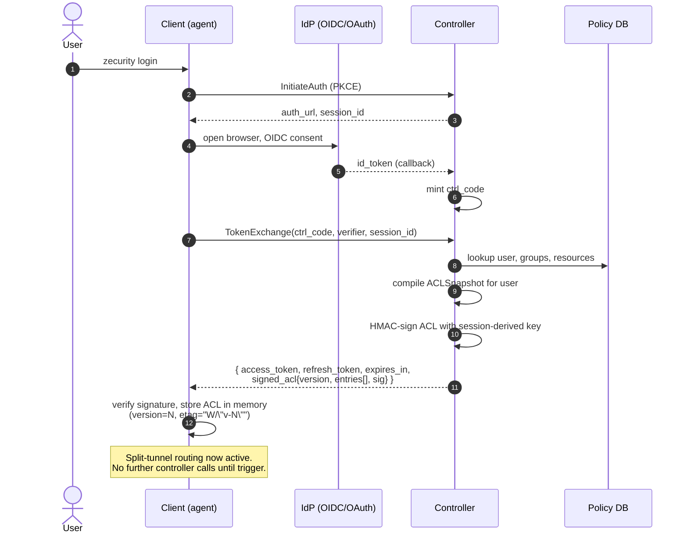
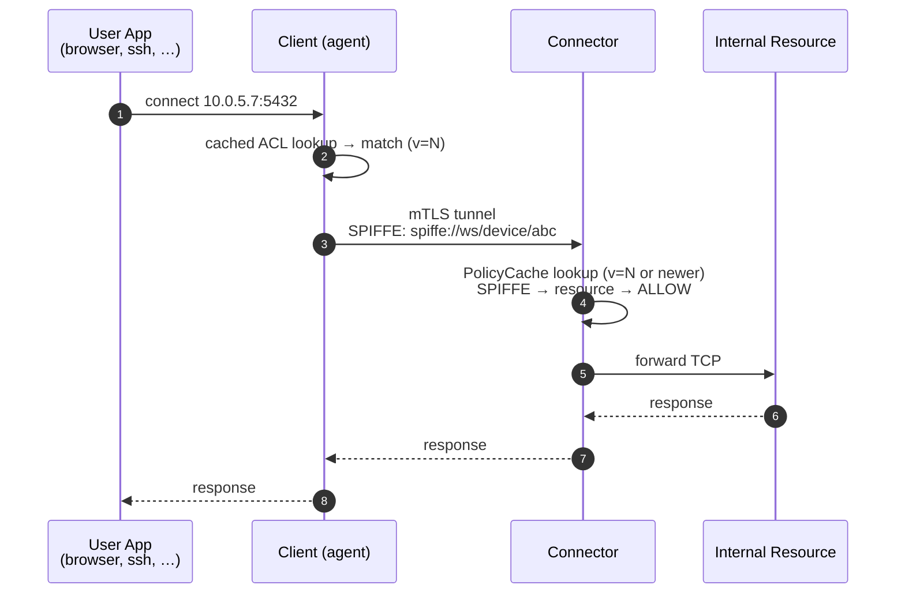
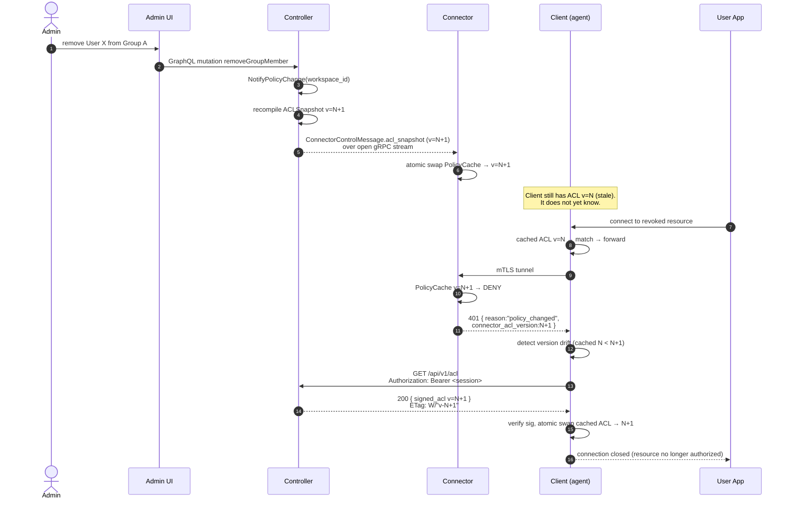
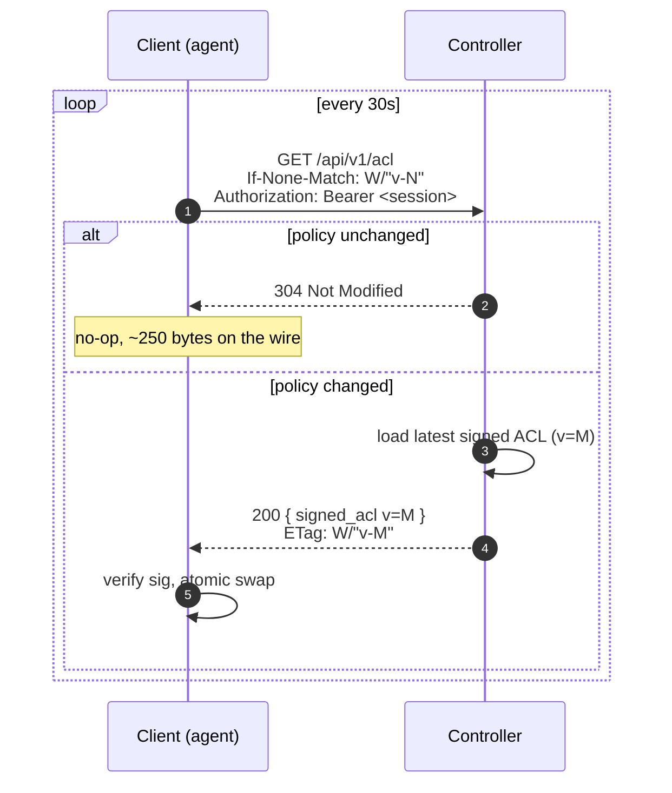
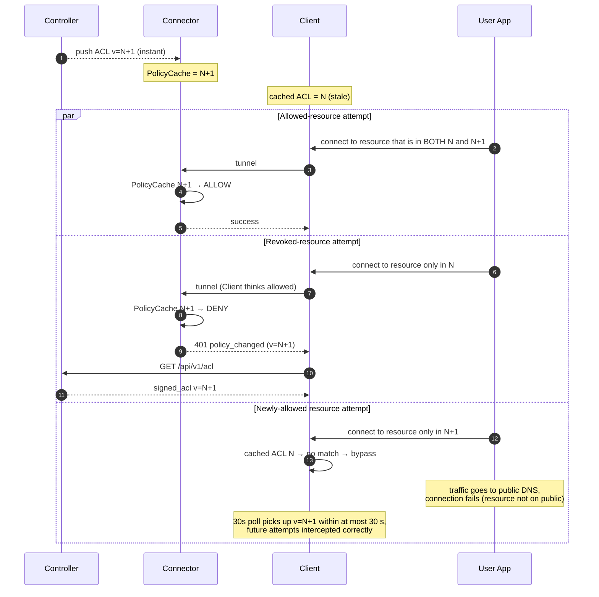

# ACL Sync Architecture

> Knowledge-base document describing how Zecurity keeps the access-control list (ACL) consistent across the Controller, Connectors, and Clients. The goal of this page is to make the *design* legible to engineers, reviewers, and security auditors. It is not a sprint plan.

---

## 1. Overview

### 1.1 The asymmetry problem

Zecurity has three runtime components that must agree on policy:

- **Controller** — the central control plane. Stores users, groups, resources, and access rules. Compiles them into per-workspace ACL snapshots.
- **Connector** — deployed inside a private network. Proxies authorized client traffic to internal resources. Holds a **persistent bidirectional gRPC stream** to the Controller.
- **Client** (agent) — installed on a user's device. Tunnels traffic to the Connector. Has **no persistent connection to the Controller**; only short-lived HTTPS calls at well-defined moments.

This asymmetry is the heart of the problem. When an admin revokes a user's access, the Controller can push the new policy to every Connector in milliseconds — the gRPC stream is already open. But the Client has gone dark since login. It still has the old ACL in memory and will keep trying to reach a resource it should no longer touch.

We solve this with **three independent ACL delivery triggers**, layered so that any single one is sufficient to recover from any single failure:

1. **Login payload** — the Controller embeds a fresh signed ACL in the auth response. The Client starts every session with an authoritative snapshot.
2. **401 from Connector** — if the Client tries a revoked resource, the Connector (which has fresh policy) rejects with a `policy_changed` signal. The Client treats this as a wake-up to fetch a new ACL over HTTPS.
3. **30-second background poll** — the Client polls `GET /api/v1/acl` with an `If-None-Match` ETag. The Controller returns `304 Not Modified` 99% of the time and a fresh signed ACL when policy actually changed. This catches the rare case where the Client never tries the revoked resource and therefore never sees a 401.

Worst-case revocation latency: **30 seconds**. Median: **<100 ms** (the 401 path).

### 1.2 Two roles for the ACL

A subtle but important point: the Client's ACL and the Connector's ACL serve **different purposes**.

- **Client ACL → routing hint.** The Client uses it to decide *which traffic to intercept* and *where to send it* (split-tunneling). A stale Client ACL causes wasted round trips to the Connector but cannot grant unauthorized access.
- **Connector ACL → authoritative authorization.** The Connector is the enforcement point. Every connection is checked against its locally-cached policy snapshot. The Connector is *always* correct — its policy is pushed over an open gRPC stream and updated synchronously with the database.

This is a deliberate **defense-in-depth split**. Even if a Client's ACL is tampered with on disk, the worst it can do is route legitimate or illegitimate traffic to the Connector, where the request will be rejected. The Client never makes a security decision; it makes a *routing* decision.

### 1.3 Comparison with related systems

| System | Client policy model | Real-time updates | Trade-off |
|--------|--------------------|--------------------|-----------|
| **Twingate** | Client receives an ACL + per-connection short-lived token from the controller for each new resource access. Connector verifies the token. | Per-connection — extremely fresh, but requires controller round-trip on every new flow. | High freshness, higher control-plane load and tail latency on first-touch flows. |
| **Firezone** | Client maintains a WebSocket to the controller. Policy decisions are evaluated in real time on the controller per packet/flow. | Sub-second push via WebSocket. | Real-time, but the controller is in the data-plane critical path; controller outage breaks new sessions. |
| **Zecurity (this design)** | Client caches a signed ACL locally. Three triggers refresh it. Connector is the authoritative enforcement point with an always-on gRPC stream. | Median <100 ms via 401-driven sync, worst case 30 s via poll. | Middle ground: controller is **never** in the per-connection hot path, Connector enforcement makes Client cache safety-irrelevant, no WebSocket required on the Client. |

The Zecurity approach trades a small amount of worst-case freshness for two operational wins: the Controller is not in the data-plane hot path, and the Client does not require a long-lived control connection (battery-friendly, NAT-friendly, no reconnection logic to babysit).

---

## 2. Sequence Diagrams

### 2.1 Login + initial ACL delivery

The Client opens its session with a signed ACL already in hand. No empty-policy window exists.



Implementation note: today's `TokenExchangeResponse` returns only the four token fields. The signed ACL is an **additive** field on the response. Older clients ignoring the field still function (they fall back to an explicit `GetACLSnapshot` call), but the canonical login flow embeds it.

### 2.2 Happy path — allowed resource

The fast path. Nothing involves the Controller.



### 2.3 Revocation flow — admin removes access

This is the critical correctness path. Connector update is synchronous; Client correction is reactive.



Two properties of this flow:

- **Connector is authoritative.** The 401 is not advisory — it is the security decision. The Client does not "retry the request" after sync; the resource is no longer in the new ACL, so split-tunneling stops intercepting it. Subsequent attempts go to the public network and fail naturally.
- **The 401 is a signal, not data.** It tells the Client "your ACL is older than mine," carrying only the version number — never the new policy. The Client always pulls fresh policy from the Controller, which is the single source of truth.

### 2.4 30-second background poll (safety net)



The poll exists to catch silent revocations. If a user is removed from a group but never tries to reach the revoked resource, the 401 path never fires. The poll guarantees the cache converges within 30 seconds regardless.

The 304 path is deliberately cheap: a single HTTP/2 request with no body, ~250 bytes including TLS framing, no DB read on the Controller side (the ETag is served from the in-memory snapshot cache).

### 2.5 Race condition — Client v=N, Connector v=N+1 simultaneously

This is a *normal* state, not an error. The design tolerates it explicitly.



The asymmetry is:
- **Revocation lag is bounded by the 401 path** (median <100 ms, only requires the user to *attempt* the revoked resource).
- **New-grant lag is bounded by the poll** (worst case 30 s). New grants do not produce a 401 — there is nothing to deny — so the only signal is the poll. This is acceptable because newly-granted access is not a security issue.

---

## 3. ACL Payload Specification

### 3.1 Signed ACL payload

This is the structure delivered both in the login response and in `GET /api/v1/acl` 200 responses. It is conceptually equivalent to the protobuf `ACLSnapshot` message defined in [`proto/client/v1/client.proto`](../proto/client/v1/client.proto), wrapped in an HMAC envelope.

```json
{
  "version": 142,
  "workspace_id": "ws_01HXY3Z9KQ2N4M5R6S7T8U9V0W",
  "user_id": "usr_01HXY40A1B2C3D4E5F6G7H8J9K",
  "device_id": "dev_01HXY40B2C3D4E5F6G7H8J9KLM",
  "issued_at": 1714492800,
  "expires_at": 1714579200,
  "entries": [
    {
      "resource_id": "res_01HXY40C2D3E4F5G6H7J8K9LMN",
      "address": "10.0.5.7",
      "port": 5432,
      "protocol": "tcp",
      "connector_id": "con_01HXY40D2E3F4G5H6J7K8L9MNP",
      "allowed_spiffe_ids": [
        "spiffe://ws_01HXY3Z9KQ2N4M5R6S7T8U9V0W/device/dev_01HXY40B2C3D4E5F6G7H8J9KLM"
      ]
    },
    {
      "resource_id": "res_01HXY40E2F3G4H5J6K7L8M9NPQ",
      "address": "internal.app.lan",
      "port": 443,
      "protocol": "tcp",
      "connector_id": "con_01HXY40D2E3F4G5H6J7K8L9MNP",
      "allowed_spiffe_ids": [
        "spiffe://ws_01HXY3Z9KQ2N4M5R6S7T8U9V0W/device/dev_01HXY40B2C3D4E5F6G7H8J9KLM"
      ]
    }
  ],
  "signature": {
    "alg": "HMAC-SHA256",
    "kid": "session_01HXY40F2G3H4J5K6L7M8N9PQR",
    "value": "kZ8c…base64url…f3Q"
  }
}
```

| Field | Type | Purpose |
|------|------|---------|
| `version` | uint64 | Monotonic per-workspace policy version. Incremented on every recompile. Used as ETag and as the value compared in the 401 response. |
| `workspace_id` | ULID | Scoping. The Client refuses an ACL whose workspace_id doesn't match its enrollment. |
| `user_id`, `device_id` | ULID | Bound the ACL to *this* identity. A leaked ACL is useless for any other device because the Connector independently checks SPIFFE on the mTLS tunnel. |
| `issued_at`, `expires_at` | unix seconds | `expires_at` is a cap (≤ 24 h). Even with no revocation, the Client cannot use a stale ACL forever. |
| `entries[]` | array | One entry per resource the user is allowed to reach. Mirrors `ACLEntry` in the proto, with the addition of `connector_id` so the Client can route. |
| `signature` | object | HMAC-SHA256 over the canonical-JSON serialization of all other fields. `kid` identifies the session-derived key. |

Canonical-JSON rules (for signing): keys sorted lexicographically, no insignificant whitespace, UTF-8, integers as bare digits. Both signer and verifier use the same canonicalizer; mismatches reject the payload.

### 3.2 401 response from Connector

The Connector returns this when an mTLS tunnel request is denied for *policy reasons* (as opposed to TLS reasons or transport failures).

```json
{
  "code": 401,
  "reason": "policy_changed",
  "connector_acl_version": 143,
  "denied_resource": {
    "address": "10.0.5.7",
    "port": 5432,
    "protocol": "tcp"
  },
  "retry_after_ms": 0
}
```

| Field | Purpose |
|------|---------|
| `reason` | Always one of `policy_changed`, `not_authorized`, `unknown_resource`. The Client only triggers a sync on `policy_changed`. The other two indicate a permanent denial — syncing won't help. |
| `connector_acl_version` | The Connector's current policy version. The Client compares to its cache; if Client's is older, it syncs. If equal or newer, the denial is genuine and no sync is performed. |
| `retry_after_ms` | Optional client-side rate-limit hint. Default 0. Used to dampen sync storms if the Controller is degraded. |

The 401 carries no policy data — only signals. This is intentional: the Connector cannot leak policy it doesn't know belongs to the Client (it knows what the Client *can't* access, not what they can).

### 3.3 `GET /api/v1/acl` contract

**Request:**

```
GET /api/v1/acl HTTP/1.1
Host: controller.example.com
Authorization: Bearer <access_token>
If-None-Match: W/"v-142"
```

**Response — unchanged (the common case):**

```
HTTP/1.1 304 Not Modified
ETag: W/"v-142"
Cache-Control: no-store
```

**Response — changed:**

```
HTTP/1.1 200 OK
Content-Type: application/json
ETag: W/"v-143"
Cache-Control: no-store

{ ...signed ACL payload as in §3.1... }
```

**Response — auth failure:**

```
HTTP/1.1 401 Unauthorized
WWW-Authenticate: Bearer error="invalid_token"
```

A 401 from the Controller (as opposed to from the Connector) means the Client's session has expired or been revoked. The Client must re-authenticate; it cannot recover with a sync.

The endpoint is `GET`, idempotent, safe to retry. It performs no DB read on the 304 path (the per-workspace version + signed payload are held in an in-memory snapshot cache invalidated by `NotifyPolicyChange`).

---

## 4. Security Analysis

### 4.1 Threat: ACL tampering on the Client device

Suppose an attacker with code execution on a user device modifies the cached ACL to add resources the user shouldn't have. **This grants nothing.** The Client only uses the ACL for routing decisions — it tells the Client which destination IPs to intercept and tunnel. When the modified Client opens a tunnel to the Connector, the Connector independently checks its own policy cache (pushed from the Controller, never from the Client) and denies the unauthorized destination. The injected entry results in a 401, not access.

This is the central reason the design tolerates the ACL living in process memory and can survive being persisted to disk in some deployments: **possession of the ACL is not authorization**.

### 4.2 Threat: ACL forgery in transit

The HMAC-SHA256 signature, keyed with a session-derived key, prevents a network attacker from injecting a forged ACL in a man-in-the-middle scenario. The session key is derived via HKDF from the OAuth/OIDC session secret known only to Controller and Client; it is never sent on the wire. An attacker who can read the TLS plaintext would see the signed payload but cannot mint a payload with a different `entries[]` array because they cannot recompute the HMAC.

The signature is *defense-in-depth* on top of TLS. TLS termination on the Controller side already prevents tampering; the HMAC ensures the ACL remains attestable end-to-end even if it is later cached, logged, or copied.

### 4.3 Threat: Replay of a stale ACL

`expires_at` (≤ 24 h) bounds the validity window. `version` lets the Client (and any auditing tool) detect that an older ACL is being presented. Combined with the 30 s poll and 401-driven sync, the practical replay window is at most one poll interval.

### 4.4 Maximum revocation latency

| Scenario | Latency bound |
|----------|---------------|
| Connector becomes aware | <10 ms (synchronous push on open gRPC stream) |
| Client becomes aware (active user) | One round trip after the next attempt to access the revoked resource (median <100 ms) |
| Client becomes aware (idle user) | At most one poll interval (30 s) |
| Client becomes aware (Controller down) | One poll interval after Controller returns; Client retries with exponential backoff, so the bound becomes 30 s + Controller MTTR |

Crucially, **no scenario allows access to a revoked resource** for any user, regardless of latency. The Connector denies it in <10 ms. The latency above is purely "how long until the Client *stops trying*."

### 4.5 Why the Connector, not the Client, is the enforcement point

A pure Client-side enforcement design (e.g., the Client itself decides whether to allow a connection based on cached ACL) is brittle in three ways: a tampered Client allows anything; a bugged Client denies things it shouldn't; an outdated Client allows revoked access. Moving enforcement to the Connector makes all three failure modes safe-by-default: the Connector is small, runs in a controlled environment (the customer's private network), and gets policy updates synchronously over an open stream. The Client cannot grant access by lying — it can only fail to *attempt* access correctly, which is a usability bug, not a security bug.

---

## 5. Edge Cases and Failure Modes

| Scenario | Behavior |
|----------|----------|
| **Controller down during 30 s poll** | Client keeps using its cached ACL (still bound by `expires_at`). The poll loop retries with exponential backoff capped at the poll interval (30 s → 60 s → 120 s, max 5 min). When the Controller recovers, the next poll either returns 304 (nothing missed) or 200 with a fresh ACL. |
| **Connector denies but Client cannot reach Controller to sync** | The Client marks the cache as "suspect" and continues retrying the sync at 5 s, 15 s, 30 s, then poll cadence. While suspect, the Client may aggressively bypass split-tunneling for *any* resource that returned a 401 in the last minute, to avoid hammering the Connector with requests it will keep rejecting. The Connector remains authoritative; nothing is granted that wasn't granted before. |
| **Client has newer ACL than Connector** | Possible if the Client polled and received v=N+1 before the Controller's gRPC push to the Connector landed (rare — the gRPC push is generally faster, but a Connector reconnection or backpressure can delay it). When the Client tunnels to the Connector, the Connector checks its (older) cache. If it denies, the Client receives a 401 with `connector_acl_version=N` and `connector_acl_version < client_acl_version`. The Client *does not* sync — its cache is already newer. It surfaces the failure to the user, optionally with a hint that the Connector is catching up. The Connector, on its next normal heartbeat-window, receives v=N+1 and reconverges. |
| **Multiple Connectors with different ACL versions** | Each Connector serves a subset of resources (per `connector_id` in the ACL entry). They do not cross-share state; the Controller pushes to each independently. Convergence of any single Connector is independent of the others. The Client routes each resource to its specific Connector, so version drift between Connectors only affects connections to the lagging one. |
| **Client's auth token expires mid-session** | The Controller returns `401 invalid_token` to a poll. The Client invokes its standard refresh-token flow. If refresh succeeds, polls resume seamlessly. If refresh fails (refresh token also revoked), the Client tears down its session and prompts the user to re-authenticate — the cached ACL is wiped. |
| **Network partition between Connector and Controller** | The Connector keeps serving from its last-pushed snapshot. The Controller marks the Connector as offline (heartbeat timeout). New policy changes are queued; on reconnect, the Controller pushes the latest snapshot, not the diff. The Client during this window sees normal Connector behavior (the Connector still has *some* policy, just possibly stale). The Client's poll continues to work because it talks to the Controller directly. |
| **`expires_at` reached with no successful poll** | The Client treats the cached ACL as invalid: stops intercepting traffic, surfaces a "session expired" state, and triggers a full re-login. This is the absolute backstop ensuring ACLs never live indefinitely. |
| **Workspace deleted while Client is connected** | The next poll returns 401 from the Controller (token no longer valid). The Client re-authenticates, fails (workspace gone), and exits cleanly. |

Retry/backoff strategy summary: polls retry at 30 s steady state, exponential backoff on Controller errors capped at 5 min. Sync-on-401 retries at 1 s, 5 s, 15 s, 30 s, then folds into the poll. The Client never retries faster than 1 s to avoid sync storms during Controller incidents.

---

## 6. Metrics

The system is instrumented with four key signals. All are emitted as Prometheus metrics on the Controller and (where relevant) Client/Connector exporters.

| Metric | Type | Labels | Emit site | Meaning |
|--------|------|--------|-----------|---------|
| `acl_sync_latency_seconds` | histogram | `workspace_id`, `trigger` (`login`/`401`/`poll`) | Controller (on serving `GET /api/v1/acl`) | Wall-clock time from policy change at the Controller to the Client confirming receipt of the new version. The Controller logs the change timestamp; the Client reports its post-swap version on the next poll, allowing the Controller to compute the delta. |
| `acl_poll_hit_rate` | counter pair | `workspace_id`, `result` (`304`/`200`) | Controller | Ratio of 304 to 200 responses on the poll endpoint. Healthy systems sit at >99% 304. A drop below 95% indicates either rapid policy churn or a malfunctioning client cache. |
| `acl_rejection_count` | counter | `workspace_id`, `reason` (`policy_changed`/`not_authorized`/`unknown_resource`) | Connector | Number of 401s returned to clients. A spike in `policy_changed` after an admin action confirms the design is doing its job. A high baseline of `not_authorized` may indicate user education or UX issues. |
| `acl_version_drift` | gauge | `workspace_id`, `component` (`client`/`connector`) | Controller (computed from polls + heartbeats) | The Controller's current version minus the median observed component version. Should hover near 0. Sustained drift indicates a stuck client population or a partitioned connector. |

These metrics together expose the health of the sync system without requiring per-user introspection. An on-call engineer seeing a healthy `acl_poll_hit_rate` and near-zero `acl_version_drift` can be confident the design is functioning, regardless of individual user reports.

---

## 7. Diagram

A companion Excalidraw page lives at [`.zecurity-obs/Excalidraw/Drawing 2026-04-27 10.44.24.excalidraw.md`](../.zecurity-obs/Excalidraw/Drawing%202026-04-27%2010.44.24.excalidraw.md). It contains a system-architecture flowchart and condensed sequence diagrams matching §2 of this document, intended for whiteboard-style review. The Mermaid sources in this document are the ground truth; the Excalidraw page is the visual aid.

---

## 8. Glossary

- **ACL** — Access Control List. A list of resources a particular user/device is allowed to reach.
- **ACL snapshot** — A point-in-time, signed, versioned ACL.
- **SPIFFE ID** — A cryptographic identity URI (e.g., `spiffe://workspace/device/<id>`) presented in mTLS by the Client to the Connector. The Connector matches it against `allowed_spiffe_ids[]` in its policy cache.
- **PolicyCache** — The Connector's in-memory copy of the latest ACL snapshot pushed by the Controller.
- **Policy version** — A monotonic uint64 per workspace, incremented on every recompile. Used as ETag and drift indicator.
- **Split-tunnel** — Client-side routing where only traffic matching the ACL is intercepted; everything else uses the device's normal network path.
- **Default-deny** — If a resource is not in the snapshot, access is denied. Applies on both Connector (authoritative) and Client (routing).
